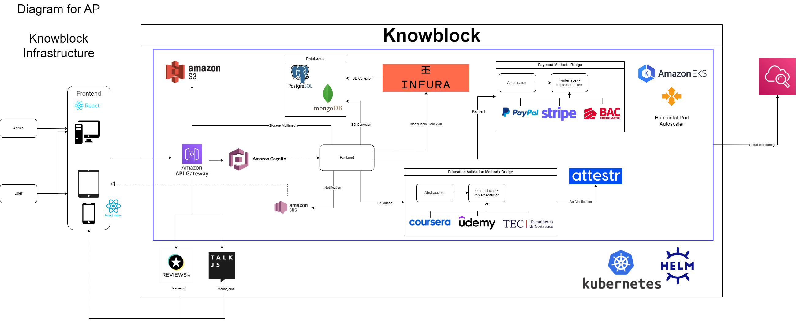

# Índice

1. [Introducción](#introducción)
2. [Estimación de Esfuerzo y Duración](#estimación-de-esfuerzo-y-duración)
   1. [Fases del Proyecto](#fases-del-proyecto)
   2. [Recursos Humanos](#recursos-humanos)
   3. [Esfuerzo Total Estimado](#esfuerzo-total-estimado)
   4. [Duración Total Estimada](#duración-total-estimada)
   5. [Consideraciones](#consideraciones)
3. [Objetivos](#objetivos)
   1. [Objetivo General](#objetivo-general)
   2. [Objetivos Específicos](#objetivos-específicos)
4. [Arquitectura Propuesta](#arquitectura-propuesta)
   1. [Microservicios Principales](#microservicios-principales)
   2. [Infraestructura y Escalabilidad](#infraestructura-y-escalabilidad)
   3. [Comunicación entre Microservicios](#comunicación-entre-microservicios)
   4. [Consideraciones de Seguridad](#consideraciones-de-seguridad)
   5. [Escalabilidad y Flexibilidad](#escalabilidad-y-flexibilidad)
5. [Documentación API de Knowblock](#documentación-api-de-knowblock)
6. [Ejemplos de Código](#ejemplos-de-código)
    1. [Conexión a Bases de Datos](#conexión-a-bases-de-datos)
    2. [Conexiones a servicios de Amazon AWS](#conexiones-a-servicios-de-amazon-aws)
    3. [Kubernetes](#kubernetes)
    4. [Otros Ejemplos Relevantes](#otros-ejemplos-relevantes)
7. [Plan de Pruebas](#plan-de-pruebas)
    1. [Objetivos del Plan de Pruebas ](#objetivos-del-plan-de-pruebas)
    2. [Alcance del Plan de Pruebas ](#alcance-del-plan-de-pruebas)
    3. [Estrategia de Pruebas del Plan de Pruebas ](#estrategia-de-pruebas-del-plan-de-pruebas)  
        1. [Pruebas Unitarias](#pruebas-unitarias)
        2. [Pruebas de Integración](#pruebas-de-integración)
        3. [Pruebas de API](#pruebas-de-api)
        4. [Pruebas de Rendimiento](#pruebas-de-rendimiento)
        5. [Pruebas de Seguridad](#pruebas-de-seguridad)
    4. [Criterios de Aceptación del Plan de Pruebas ](#criterios-de-aceptación-del-plan-de-pruebas)
    5. [Cronograma del Plan de Pruebas ](#cronograma-del-plan-de-pruebas)
    6. [Riesgos y Mitigaciones del Plan de Pruebas ](#riesgos-y-mitigaciones-del-plan-de-pruebas)
    7. [Entregables del Plan de Pruebas ](#entregables-del-plan-de-pruebas)
8. [Recomendaciones](#recomendaciones)
9. [Conclusiones](#conclusiones)

## Introducción 
Esta Prueba de Concepto (PoC) tiene como objetivo evaluar la viabilidad técnica del proyecto KnowBlock, una plataforma innovadora de validación de conocimientos que integra tecnología blockchain, sistemas de bases de datos avanzados y una arquitectura de microservicios. KnowBlock se propone revolucionar la forma en que se verifican y certifican las habilidades y conocimientos adquiridos, garantizando la autenticidad e inmutabilidad de los procesos de validación a través de registros seguros en blockchain, mientras que la implementación de microservicios permitirá un desarrollo modular, escalable y altamente adaptable a las cambiantes necesidades del mercado educativo y profesional.

La PoC se enfoca en simular los principales flujos del sistema, como la validación de conocimientos, la conexión con métodos educativos tradicionales y en línea, y la gestión de pagos, sin la necesidad de implementar código completo en esta etapa inicial. Además, se diseñarán y probarán teóricamente los endpoints que integran los diferentes componentes, permitiendo una evaluación exhaustiva de la arquitectura propuesta.

Sin embargo, es crucial reconocer y abordar los desafíos técnicos inherentes a un proyecto de esta envergadura. Uno de los principales retos es la latencia asociada con las transacciones en blockchain, que podría afectar la experiencia del usuario en procesos que requieren confirmación inmediata. Para mitigar este problema, la PoC explorará la implementación de soluciones de capa 2 y la optimización de los procesos de escritura en la cadena, reservando las transacciones en blockchain para los momentos críticos de la validación.

Otro desafío significativo es la escalabilidad de la infraestructura propuesta. A medida que la plataforma crezca en usuarios y volumen de datos, será crucial mantener un rendimiento óptimo. La PoC evaluará estrategias de escalado horizontal para los microservicios, así como la implementación de bases de datos distribuidas que puedan manejar grandes volúmenes de información sin comprometer la velocidad de acceso.

La interoperabilidad entre diferentes blockchains y sistemas educativos tradicionales representa otro reto importante. La PoC investigará la viabilidad de implementar protocolos de comunicación estandarizados y APIs robustas que permitan una integración fluida con diversas instituciones educativas y plataformas de aprendizaje en línea.
Además, se abordarán cuestiones de seguridad y privacidad de datos, cruciales en un sistema que maneja información sensible sobre logros educativos y profesionales. La PoC evaluará la implementación de técnicas de encriptación avanzadas, gestión segura de claves y mecanismos de control de acceso granular.

Con esta aproximación integral, se pretende no solo reducir riesgos técnicos, sino también asegurar que la infraestructura propuesta cumpla con los requisitos funcionales y tecnológicos antes de avanzar a etapas más avanzadas del desarrollo. La PoC servirá como un cimiento sólido para la toma de decisiones informadas sobre la viabilidad y el diseño final de KnowBlock, permitiendo ajustes y optimizaciones basados en los resultados obtenidos durante esta fase crucial de evaluación y prueba.

## Estimación de Esfuerzo y Duración

Esta sección detalla las fases, recursos humanos, esfuerzo total y duración estimada del proyecto, proporcionando una hoja de ruta clara para su ejecución.

### Fases del Proyecto

El proyecto se divide en varias fases, cada una con tiempos estimados en función de la complejidad de las tareas a realizar:

1. **Análisis y Diseño** (2 semanas):
  - Definición de requerimientos funcionales y no funcionales.
  - Diseño de arquitectura del sistema, incluyendo la estructura de microservicios y selección de tecnologías.
  - Diagramas de flujo y modelo de datos.

2. **Desarrollo de Microservicios** (8 semanas):
  - Implementación de los servicios backend, cada uno enfocado en una funcionalidad específica.
  - Uso de arquitecturas basadas en eventos para garantizar comunicación eficiente entre servicios.
  - Creación de APIs REST y servicios de integración con bases de datos.

3. **Integración con Blockchain** (3 semanas):
  - Implementación de módulos para registrar y verificar transacciones en la cadena de bloques.
  - Pruebas de integración con plataformas blockchain (como Ethereum o Hyperledger).
  - Manejo de confirmaciones de bloques y tratamiento de errores en las transacciones.

4. **Desarrollo de Frontend** (6 semanas):
  - Creación de interfaces de usuario intuitivas para estudiantes, docentes y administradores.
  - Integración con el backend mediante APIs.
  - Pruebas de usabilidad y diseño adaptativo para dispositivos móviles.

5. **Pruebas y Depuración** (4 semanas):
  - Ejecución de pruebas unitarias, de integración y de extremo a extremo.
  - Validación del sistema en condiciones de carga y estrés.
  - Corrección de errores encontrados y refinamiento del rendimiento.

6. **Despliegue y Configuración** (2 semanas):
  - Configuración del entorno de producción, incluyendo orquestación de contenedores y balanceo de carga.
  - Despliegue de los servicios en la infraestructura elegida (cloud o servidores on-premise).
  - Monitoreo inicial para asegurar la estabilidad del sistema.

### Recursos Humanos

Para cumplir con los plazos establecidos, se ha planificado un equipo multidisciplinario que incluye:

- 2 Arquitectos de Software: Definen la arquitectura del sistema y supervisan la coherencia técnica durante todo el proyecto.

- 4 Desarrolladores Backend: Encargados de la implementación de microservicios y lógica de negocio.

- 2 Desarrolladores Frontend: Responsables del desarrollo de las interfaces de usuario para diferentes plataformas.

- 2 Ingenieros DevOps: Gestionan la infraestructura y los procesos de integración continua (CI/CD).

- 1 Especialista en Blockchain: Asiste en la integración y optimización de las transacciones en blockchain.

- 2 QA Testers: Realizan pruebas exhaustivas para asegurar la calidad del producto antes de su lanzamiento.

### Esfuerzo Total Estimado

El cálculo del esfuerzo total combina la duración del proyecto con la carga de trabajo asignada a cada miembro del equipo. El resultado se mide en horas-persona:

25 semanas × 11 personas × 40 horas/semana = 11,000 horas-persona

Este esfuerzo incluye tanto las tareas de desarrollo como las actividades de planificación, revisión y gestión del proyecto.

### Duración Total Estimada

25 semanas (aproximadamente 6 meses)

La duración total tiene en cuenta la ejecución paralela de algunas fases, especialmente el desarrollo del frontend y backend. Esta estructura en paralelo permite optimizar los tiempos y reducir el riesgo de retrasos.

### Consideraciones

- **Desarrollo en paralelo**: Las tareas del frontend y backend se llevarán a cabo simultáneamente para optimizar tiempos.
- **Margen para imprevistos**: Se ha considerado un margen adicional para gestionar cambios de alcance, refinamiento del producto y corrección de errores críticos.
- **Complejidad de la integración**: La duración podría variar en función de las dificultades encontradas al conectar el sistema con plataformas educativas o blockchain.

Estas estimaciones sirven como una guía para asegurar una entrega dentro del tiempo previsto, aunque se mantendrá una revisión constante del cronograma para ajustar plazos si es necesario.
## Objetivos 

### Objetivo General

Desarrollar y validar una plataforma innovadora de gestión y certificación de conocimientos (KnowBlock) que integre tecnología blockchain, bases de datos avanzadas y una arquitectura de microservicios, garantizando la autenticidad, inmutabilidad y accesibilidad de las validaciones de habilidades y conocimientos en el ámbito educativo y profesional.

### Objetivos Específicos

1. Diseñar e implementar una arquitectura de microservicios escalable y flexible que soporte los procesos de validación de conocimientos, gestión de usuarios y procesamiento de pagos.

2. Integrar tecnología blockchain para asegurar la inmutabilidad y trazabilidad de los registros de validación de conocimientos, implementando soluciones para optimizar la latencia de las transacciones.

3. Desarrollar un sistema de autenticación y autorización robusto que garantice la seguridad y privacidad de los datos de los usuarios.

4. Implementar APIs RESTful para facilitar la interoperabilidad entre los microservicios y la integración con sistemas educativos externos.

5. Crear un sistema de procesamiento de pagos seguro y eficiente que soporte múltiples métodos de pago y cumpla con los estándares de seguridad PCI DSS.

6. Diseñar y ejecutar un plan de pruebas exhaustivo que valide la funcionalidad, rendimiento, seguridad y escalabilidad de la plataforma.

7. Desarrollar mecanismos de generación de reportes y análisis de datos para proporcionar insights valiosos sobre el uso de la plataforma y las tendencias en validación de conocimientos.

8. Implementar un sistema de notificaciones en tiempo real para mantener a los usuarios informados sobre el estado de sus validaciones y transacciones.

9. Optimizar la experiencia de usuario a través de interfaces intuitivas y responsivas, facilitando el proceso de validación de conocimientos y la gestión de perfiles.

10. Establecer protocolos y mecanismos para la escalabilidad horizontal de la plataforma, asegurando su capacidad para manejar un crecimiento significativo en el número de usuarios y transacciones.

## Arquitectura Propuesta

La arquitectura de KnowBlock está construida sobre un modelo de microservicios, diseñado para el desarrollo descentralizado y la escalabilidad. Cada componente tiene una función específica y puede desplegarse de manera independiente. Esta estructura facilita la integración eficiente con bases de datos, blockchain y sistemas de pago.

Primeramente antes de iniciar con la explicacion de la arquitectura se anexa la imagen de la arquitectura del sistema:



### Microservicios Principales

#### 1. Microservicio de Verificación de Conocimiento (API de Verificación)

**Propósito:** Central en KnowBlock, este servicio gestiona solicitudes de validación de conocimiento y registra los resultados en la blockchain.

**Funciones Clave:**
- Procesar solicitudes de validación desde el frontend
- Registrar validaciones en la blockchain para garantizar la inmutabilidad
- Comunicar los resultados a administradores y usuarios

**Tecnologías:**
- Node.js para el marco de trabajo REST API
- INFURA para la integración con blockchain
- Postman para la simulación de endpoints
- HTTPS para la comunicación segura

**Interacciones:**
- Recibe solicitudes desde el frontend
- Se comunica con la blockchain (a través de INFURA)
- Envía respuestas al microservicio de Autenticación de Usuarios

#### 2. Microservicio de Autenticación y Gestión de Usuarios

**Propósito:** Gestiona la creación de usuarios, autenticación y control de roles.

**Funciones Clave:**
- Autenticación de usuarios mediante Amazon Cognito
- Control de acceso basado en roles
- Registro de usuarios y recuperación de credenciales

**Tecnologías:**
- PostgreSQL para almacenar credenciales y roles
- MongoDB para almacenar comentarios y estructuras abstractas
- Amazon Cognito para la gestión de tokens de acceso
- OpenSSL para la encriptación de contraseñas

**Interacciones:**
- Se comunica con el frontend para acciones de usuario
- Interactúa con bases de datos para el almacenamiento y recuperación de datos de usuarios
- Proporciona estado de autenticación a otros microservicios

#### 3. Microservicio de Validación Educativa y Académica

**Propósito:** Gestiona la lógica para la validación de logros educativos.

**Funciones Clave:**
- Conecta con plataformas de e-learning (por ejemplo, Moodle, Coursera)
- Implementa el patrón Bridge para facilitar la integración de nuevos métodos
- Proporciona interfaces para consultas de resultados

**Tecnologías:**
- Integración con APIs de plataformas de e-learning
- Kubernetes para la orquestación de microservicios

**Interacciones:**
- Se comunica con plataformas educativas externas
- Envía resultados de validación al microservicio de Verificación de Conocimiento

#### 4. Microservicio de Gestión de Pagos

**Propósito:** Gestiona los procesos de pago para certificaciones o servicios premium.

**Funciones Clave:**
- Integra múltiples pasarelas de pago (PayPal, Stripe)
- Registra transacciones exitosas en la base de datos
- Usa el patrón Bridge para la fácil adición de nuevas opciones de pago

**Tecnologías:**
- Integraciones con API de Stripe y PayPal
- TLS/SSL para la seguridad de las transacciones
- PostgreSQL para el almacenamiento de transacciones

**Interacciones:**
- Se comunica con pasarelas de pago externas
- Interactúa con la base de datos para registrar transacciones
- Notifica al microservicio de Notificaciones sobre pagos exitosos

#### 5. Microservicio de Notificaciones y Mensajería

**Propósito:** Gestiona alertas y notificaciones para usuarios y administradores.

**Funciones Clave:**
- Envía notificaciones vía email, SMS o push
- Facilita la mensajería interna entre usuarios y administradores

**Tecnologías:**
- Amazon SNS para la entrega de notificaciones
- Talk.io para el chat interno en tiempo real

**Interacciones:**
- Recibe activadores de notificaciones desde otros microservicios
- Se comunica directamente con usuarios a través de varios canales

### Infraestructura y Escalabilidad

- **Horizontal Pod Autoscaler (HPA):** Utiliza Kubernetes para el escalado automático de pods basado en la demanda.
- **Almacenamiento Multimedia:** Usa servicios de almacenamiento en la nube (Amazon S3 o Google Cloud Storage) para la gestión de archivos de usuarios.
- **Monitoreo:** Emplea Cloud Monitoring para el seguimiento de métricas críticas como uso de CPU, memoria y latencia.

### Comunicación entre Microservicios

- APIs RESTful se utilizan para la comunicación sincrónica entre microservicios.
- Colas de mensajes (por ejemplo, RabbitMQ o Apache Kafka) podrían implementarse para la comunicación asincrónica, aunque no se menciona explícitamente en la descripción original.

### Consideraciones de Seguridad

- Toda la comunicación entre microservicios está encriptada utilizando HTTPS.
- La autenticación de usuarios está centralizada y gestionada por el microservicio de Autenticación.
- Datos sensibles, como la información de pago, se gestionan de forma segura con cifrado estándar de la industria.

### Escalabilidad y Flexibilidad

- La arquitectura de microservicios permite el escalado independiente de cada componente.
- Nuevas plataformas educativas o métodos de pago pueden integrarse sin afectar al sistema completo.
- La orquestación con Kubernetes permite una asignación eficiente de recursos y gestión de servicios.

Esta arquitectura proporciona a KnowBlock una base robusta, escalable y flexible para gestionar la verificación de conocimientos, interacciones de usuarios y servicios asociados.


# Documentación API de Knowblock

## URL Base

```
https://api.knowblock.com/v1
```

## Autenticación

Todas las solicitudes a la API requieren un token JWT válido en el encabezado de Autorización:

```
Authorization: Bearer <token>
```

## Endpoints

### 1. Registro de Usuario

- **Nombre**: Registrar Usuario
- **Descripción**: Registra un nuevo usuario en la plataforma Knowblock, creando su perfil inicial y estableciendo sus credenciales de acceso.
- **Método HTTP**: POST
- **URL**: `/usuarios/registro`

#### Cuerpo de la Solicitud

```json
{
  "nombre": "Juan",
  "apellido": "Pérez",
  "email": "juan.perez@ejemplo.com",
  "contrasena": "Cl@ve$egura123!",
  "fechaNacimiento": "1990-01-15",
  "pais": "España",
  "nivelEducativo": "Universitario",
  "areaInteres": ["Tecnología", "Educación"]
}
```

#### Encabezados

```
Content-Type: application/json
```

#### Respuestas

##### 201 Created

```json
{
  "usuarioId": "usr_12345abcde",
  "mensaje": "Usuario registrado exitosamente",
  "perfilUrl": "https://knowblock.com/perfil/juan.perez",
  "tokenActivacion": "act_xyz789",
  "instrucciones": "Por favor, active su cuenta haciendo clic en el enlace enviado a su correo electrónico."
}
```

##### 400 Bad Request

```json
{
  "error": "Datos de entrada inválidos",
  "detalles": [
    "El email ya está en uso",
    "La contraseña debe tener al menos 10 caracteres, incluyendo mayúsculas, minúsculas, números y símbolos",
    "El país especificado no es válido"
  ]
}
```

##### 409 Conflict

```json
{
  "error": "Conflicto en el registro",
  "mensaje": "Ya existe una cuenta asociada a este correo electrónico",
  "accionRecomendada": "Si olvidó su contraseña, puede usar la opción de recuperación de cuenta"
}
```

#### Notas Adicionales
- La contraseña debe cumplir con políticas de seguridad estrictas.
- Se envía un correo de verificación al email proporcionado.
- Los datos se almacenan de forma segura en la base de datos PostgreSQL.
- Se recomienda implementar un sistema de captcha para prevenir registros automatizados.

### 2. Autenticación de Usuario

- **Nombre**: Iniciar Sesión de Usuario
- **Descripción**: Autentica a un usuario existente y devuelve un token JWT para su uso en futuras solicitudes a la API.
- **Método HTTP**: POST
- **URL**: `/usuarios/login`

#### Cuerpo de la Solicitud

```json
{
  "email": "juan.perez@ejemplo.com",
  "contrasena": "Cl@ve$egura123!"
}
```

#### Encabezados

```
Content-Type: application/json
```

#### Respuestas

##### 200 OK

```json
{
  "token": "eyJhbGciOiJIUzI1NiIsInR5cCI6IkpXVCJ9...",
  "usuarioId": "usr_12345abcde",
  "expiraEn": 3600,
  "tipoToken": "Bearer",
  "permisos": ["lectura", "escritura", "validacion"],
  "ultimoAcceso": "2024-03-17T10:30:00Z"
}
```

##### 400 Bad Request

```json
{
  "error": "Datos de entrada inválidos",
  "mensaje": "El email o la contraseña están vacíos o no cumplen con el formato requerido"
}
```

##### 401 Unauthorized

```json
{
  "error": "Autenticación fallida",
  "mensaje": "Email o contraseña incorrectos",
  "intentosRestantes": 2,
  "tiempoBloqueo": null
}
```

#### Notas Adicionales
- Implementar un sistema de bloqueo temporal después de varios intentos fallidos.
- El token JWT debe incluir información relevante como el ID del usuario y sus permisos.
- Registrar cada intento de inicio de sesión para análisis de seguridad.
- Considerar la implementación de autenticación de dos factores para mayor seguridad.

### 3. Obtener Información de Usuario

- **Nombre**: Obtener Perfil de Usuario
- **Descripción**: Recupera la información detallada del perfil de un usuario específico basado en su ID.
- **Método HTTP**: GET
- **URL**: `/usuarios/{usuarioId}`

#### Parámetros de Ruta
- `usuarioId` (string): Identificador único del usuario.

#### Encabezados

```
Authorization: Bearer <token>
```

#### Respuestas

##### 200 OK

```json
{
  "usuarioId": "usr_12345abcde",
  "nombre": "Juan",
  "apellido": "Pérez",
  "email": "juan.perez@ejemplo.com",
  "fechaNacimiento": "1990-01-15",
  "pais": "España",
  "nivelEducativo": "Universitario",
  "areasInteres": ["Tecnología", "Educación"],
  "conocimientosValidados": [
    {
      "id": "con_789xyz",
      "titulo": "Introducción a Blockchain",
      "institucion": "Universidad Tecnológica",
      "fechaValidacion": "2024-02-20",
      "hashBlockchain": "0x..."
    }
  ],
  "redesSociales": {
    "linkedin": "https://linkedin.com/in/juanperez",
    "github": "https://github.com/juanperez"
  },
  "estadoCuenta": "activo",
  "fechaRegistro": "2024-01-01T00:00:00Z",
  "ultimoAcceso": "2024-03-17T10:30:00Z"
}
```

##### 400 Bad Request

```json
{
  "error": "Solicitud inválida",
  "mensaje": "El ID de usuario proporcionado no tiene un formato válido"
}
```

##### 403 Forbidden

```json
{
  "error": "Acceso denegado",
  "mensaje": "No tiene permisos para ver esta información",
  "razon": "El token proporcionado no corresponde al usuario solicitado o no tiene los permisos necesarios"
}
```

##### 404 Not Found

```json
{
  "error": "Usuario no encontrado",
  "mensaje": "No se encontró ningún usuario con el ID proporcionado",
  "sugerencia": "Verifique el ID del usuario e intente nuevamente"
}
```

#### Notas Adicionales
- Implementar cache para mejorar el rendimiento en solicitudes frecuentes.
- Considerar la posibilidad de incluir un parámetro para controlar el nivel de detalle de la información devuelta.
- Asegurar que la información sensible (como la fecha de nacimiento) solo se muestre a usuarios autorizados.
- Incluir enlaces a recursos relacionados, como los conocimientos validados del usuario.

### 4. Actualizar Información de Usuario

- **Nombre**: Actualizar Perfil de Usuario
- **Descripción**: Permite la actualización de la información del perfil de un usuario existente.
- **Método HTTP**: PUT
- **URL**: `/usuarios/{usuarioId}`

#### Parámetros de Ruta
- `usuarioId` (string): Identificador único del usuario.

#### Cuerpo de la Solicitud

```json
{
  "nombre": "Juan Carlos",
  "apellido": "Pérez González",
  "nivelEducativo": "Postgrado",
  "areasInteres": ["Tecnología", "Educación", "Inteligencia Artificial"],
  "redesSociales": {
    "linkedin": "https://linkedin.com/in/juancperez",
    "github": "https://github.com/juancperez",
    "twitter": "https://twitter.com/juancperez"
  },
  "biografia": "Profesional en tecnología con más de 5 años de experiencia en desarrollo de software y educación en línea."
}
```

#### Encabezados

```
Content-Type: application/json
Authorization: Bearer <token>
```

#### Respuestas

##### 200 OK

```json
{
  "usuarioId": "usr_12345abcde",
  "mensaje": "Perfil actualizado exitosamente",
  "cambiosRealizados": [
    "Nombre actualizado",
    "Apellido actualizado",
    "Nivel educativo actualizado",
    "Áreas de interés actualizadas",
    "Redes sociales actualizadas",
    "Biografía añadida"
  ],
  "fechaActualizacion": "2024-03-17T14:45:00Z",
  "perfilUrl": "https://knowblock.com/perfil/juancperez"
}
```

##### 400 Bad Request

```json
{
  "error": "Datos inválidos",
  "detalles": [
    "El nivel educativo proporcionado no es válido",
    "La URL de LinkedIn no tiene un formato correcto"
  ],
  "sugerencias": [
    "Los niveles educativos válidos son: 'Secundaria', 'Universitario', 'Postgrado', 'Doctorado'",
    "Asegúrese de incluir 'https://' en las URLs de redes sociales"
  ]
}
```

##### 403 Forbidden

```json
{
  "error": "Acceso denegado",
  "mensaje": "No tiene permisos para modificar este perfil",
  "razon": "El token proporcionado no corresponde al usuario o ha expirado"
}
```

##### 404 Not Found

```json
{
  "error": "Usuario no encontrado",
  "mensaje": "No se encontró ningún usuario con el ID proporcionado",
  "sugerencia": "Verifique el ID del usuario e intente nuevamente"
}
```

#### Notas Adicionales
- Implementar validación de campos para asegurar la integridad de los datos.
- Considerar la posibilidad de actualización parcial (PATCH) para modificaciones menores.
- Registrar historial de cambios para auditoría y posible reversión.
- Enviar notificación al usuario sobre los cambios realizados en su perfil.
- Actualizar cualquier caché relacionada con la información del usuario.

### 5. Enviar Solicitud de Validación de Conocimiento

- **Nombre**: Enviar Solicitud de Validación de Conocimiento
- **Descripción**:  Permite a un usuario enviar una solicitud para validar un conocimiento adquirido, iniciando el proceso de verificación en la plataforma.
- **Método HTTP**: POST
- **URL**: `/api/knowledge/validate`

#### Cuerpo de la Solicitud

```json
{
  "usuarioId": "usr_12345abcde",
  "conocimiento": {
    "titulo": "Fundamentos de Inteligencia Artificial",
    "descripcion": "Curso completo sobre los principios básicos de IA",
    "institucion": "Universidad Tecnológica de Ejemplo",
    "fechaFinalizacion": "2024-02-15",
    "tipoCredencial": "certificado"
  },
  "evidencias": [
    {
      "tipo": "certificado",
      "url": "https://ejemplo.com/certificados/ia_fundamentos.pdf"
    },
    {
      "tipo": "proyecto",
      "url": "https://github.com/usuario/proyecto-ia-final"
    }
  ],
  "detallesAdicionales": "Completé el curso con una calificación de 95/100"
}
```

#### Encabezados

```
Content-Type: application/json
Authorization: Bearer <token>
```

#### Respuestas

##### 200 OK

```json
{
  "validacionId": "val_789xyz",
  "estado": "pendiente",
  "fechaSolicitud": "2024-03-18T15:30:00Z",
  "estimacionFinalizacion": "2024-03-25T15:30:00Z",
  "pasosSiguientes": [
    "Revisión inicial de la documentación",
    "Verificación con la institución emisora",
    "Evaluación por pares expertos"
  ],
  "mensajeUsuario": "Su solicitud de validación ha sido recibida y está siendo procesada. Le notificaremos cuando haya actualizaciones.",
  "urlSeguimiento": "https://knowblock.com/validaciones/val_789xyz"
}
```

##### 400 Bad Request

```json
{
  "error": "Datos faltantes o inválidos",
  "detalles": [
    "El campo 'titulo' del conocimiento es obligatorio",
    "La fecha de finalización no puede ser futura",
    "Se requiere al menos una evidencia válida"
  ],
  "sugerencias": [
    "Asegúrese de proporcionar un título para el conocimiento a validar",
    "Verifique que la fecha de finalización sea anterior o igual a la fecha actual",
    "Adjunte al menos un documento o enlace como evidencia del conocimiento"
  ]
}
```

##### 401 Unauthorized

```json
{
  "error": "No autorizado para solicitar validación",
  "mensaje": "Su cuenta no tiene los permisos necesarios para solicitar validaciones de conocimiento",
  "razon": "Es necesario completar el perfil de usuario y verificar la cuenta de email",
  "accionesRecomendadas": [
    "Complete su perfil de usuario en la plataforma",
    "Verifique su dirección de email siguiendo el enlace enviado a su correo",
    "Si el problema persiste, contacte al soporte técnico"
  ]
}
```

#### Notas Adicionales
- Implementar un sistema de cuotas para limitar el número de solicitudes de validación por usuario en un período determinado.
- Considerar la integración con servicios de verificación de documentos para automatizar parte del proceso.
- Mantener un registro detallado de todas las solicitudes y sus estados para auditorías y mejora del proceso.
- Ofrecer la opción de guardar borradores de solicitudes para que los usuarios puedan completarlas en múltiples sesiones.
Implementar un sistema de notificaciones para mantener al usuario informado sobre el progreso de su solicitud.

### 6. Consultar Estado de Validación de Conocimiento

- **Nombre**: Obtener Estado de Validación de Conocimiento
- **Descripción**: Permite consultar el estado actual de una solicitud de validación de conocimiento previamente enviada.
- **Método HTTP**: GET
- **URL**: `/conocimientos/{validacionId}/estado`

#### Parámetros de Ruta
- `validacionId` (string): Identificador único de la solicitud de validación.

#### Encabezados

```
Authorization: Bearer <token>
```

#### Respuestas

##### 200 OK

```json
{
  "validacionId": "val_789xyz",
  "estado": "en_proceso",
  "etapaActual": "verificación_institución",
  "progreso": 60,
  "fechaActualizacion": "2024-03-18T10:15:00Z",
  "detalles": {
    "etapasCompletadas": [
      "recepción_solicitud",
      "revisión_inicial_documentos",
      "verificación_identidad_usuario"
    ],
    "etapasPendientes": [
      "validación_por_pares",
      "registro_blockchain"
    ],
    "comentarios": "Esperando respuesta de la Universidad Tecnológica de Ejemplo para confirmar la autenticidad del certificado."
  },
  "estimacionFinalizacion": "2024-03-20T18:00:00Z",
  "hashBlockchain": null,
  "urlSeguimiento": "https://knowblock.com/validaciones/val_789xyz"
}
```

##### 400 Bad Request

```json
{
  "error": "Solicitud inválida",
  "mensaje": "El ID de validación proporcionado no tiene un formato válido",
  "sugerencia": "Asegúrese de utilizar el ID de validación completo, incluyendo el prefijo 'val_'"
}
```

##### 403 Forbidden

```json
{
  "error": "Acceso denegado",
  "mensaje": "No tiene permisos para consultar esta validación",
  "razon": "La validación pertenece a otro usuario o su token ha expirado"
}
```

##### 404 Not Found

```json
{
  "error": "Validación no encontrada",
  "mensaje": "No se encontró ninguna validación con el ID proporcionado",
  "sugerencia": "Verifique el ID de validación e intente nuevamente"
}
```

#### Notas Adicionales
- Implementar un sistema de caché para mejorar el rendimiento en consultas frecuentes.
- Considerar la posibilidad de incluir un webhook para notificar cambios de estado automáticamente.
- Asegurar que solo el usuario propietario de la validación o personal autorizado pueda acceder a esta información.
- Registrar cada consulta para análisis de uso y detección de patrones sospechosos.

### 7. Procesar Pago

- **Nombre**: Procesar Pago de Usuario
- **Descripción**: Procesa un pago para un usuario utilizando la pasarela de pago seleccionada, permitiendo la adquisición de servicios o validaciones en la plataforma.
- **Método HTTP**: POST
- **URL**: `/pagos/procesar`

#### Cuerpo de la Solicitud

```json
{
  "usuarioId": "usr_12345abcde",
  "monto": 99.99,
  "moneda": "EUR",
  "metodoPago": "tarjeta",
  "detallesPago": {
    "numeroTarjeta": "4111111111111111",
    "mesExpiracion": "12",
    "anioExpiracion": "2025",
    "cvv": "123",
    "nombreTitular": "Juan Pérez"
  },
  "conceptoPago": "Validación de conocimiento en IA",
  "idReferencia": "val_789xyz",
  "guardarMetodoPago": true
}
```

#### Encabezados

```
Content-Type: application/json
Authorization: Bearer <token>
```

#### Respuestas

##### 201 Created

```json
{
  "pagoId": "pag_456def",
  "estado": "completado",
  "transaccionId": "txn_9876543210",
  "monto": 99.99,
  "moneda": "EUR",
  "metodoPago": "tarjeta",
  "ultimosCuatroDigitos": "1111",
  "fechaProcesamiento": "2024-03-18T11:30:00Z",
  "conceptoPago": "Validación de conocimiento en IA",
  "idReferencia": "val_789xyz",
  "comprobanteUrl": "https://knowblock.com/pagos/comprobante/pag_456def.pdf",
  "metodosPagoGuardados": [
    {
      "id": "mp_789ghi",
      "tipo": "tarjeta",
      "ultimosCuatroDigitos": "1111",
      "marca": "Visa",
      "fechaExpiracion": "12/2025"
    }
  ]
}
```

##### 400 Bad Request

```json
{
  "error": "Información de pago inválida o incompleta",
  "detalles": [
    "El número de tarjeta no es válido",
    "La fecha de expiración es anterior a la fecha actual"
  ],
  "sugerencias": [
    "Verifique que el número de tarjeta tenga 16 dígitos",
    "Asegúrese de que la fecha de expiración sea futura"
  ]
}
```

##### 402 Payment Required

```json
{
  "error": "Pago rechazado",
  "mensaje": "La transacción no pudo ser procesada por la entidad financiera",
  "codigoError": "insufficient_funds",
  "descripcion": "Fondos insuficientes en la cuenta",
  "accionesRecomendadas": [
    "Verificar el saldo disponible en la tarjeta",
    "Intentar con un método de pago alternativo"
  ]
}
```

##### 403 Forbidden

```json
{
  "error": "Acceso denegado",
  "mensaje": "No tiene permisos para realizar este pago",
  "razon": "El token proporcionado no corresponde al usuario o ha expirado"
}
```

#### Notas Adicionales
- Implementar encriptación de extremo a extremo para los datos sensibles de pago.
- Cumplir con las normativas PCI DSS para el manejo de información de tarjetas de crédito.
- Considerar la implementación de un sistema de detección de fraudes.
- Ofrecer opciones de pago recurrente para servicios de suscripción.
- Integrar con múltiples pasarelas de pago para mayor flexibilidad y redundancia.

### 8. Consultar Estado de Pago

- **Nombre**: Obtener Estado de Pago
- **Descripción**: Permite consultar el estado actual de un pago previamente procesado en la plataforma.
- **Método HTTP**: GET
- **URL**: `/pagos/{pagoId}/estado`

#### Parámetros de Ruta
- `pagoId` (string): Identificador único del pago.

#### Encabezados

```
Authorization: Bearer <token>
```

#### Respuestas

##### 200 OK

```json
{
  "pagoId": "pag_456def",
  "estado": "completado",
  "detallesEstado": {
    "codigo": "payment_success",
    "descripcion": "El pago se ha procesado y confirmado exitosamente"
  },
  "transaccionId": "txn_9876543210",
  "monto": 99.99,
  "moneda": "EUR",
  "metodoPago": {
    "tipo": "tarjeta",
    "ultimosCuatroDigitos": "1111",
    "marca": "Visa"
  },
  "fechaProcesamiento": "2024-03-18T11:30:00Z",
  "fechaActualizacion": "2024-03-18T11:31:15Z",
  "conceptoPago": "Validación de conocimiento en IA",
  "idReferencia": "val_789xyz",
  "comprobanteUrl": "https://knowblock.com/pagos/comprobante/pag_456def.pdf",
  "desglosePago": {
    "subtotal": 95.00,
    "impuestos": 4.99,
    "total": 99.99
  },
  "historialEstados": [
    {
      "estado": "iniciado",
      "fecha": "2024-03-18T11:29:45Z"
    },
    {
      "estado": "procesando",
      "fecha": "2024-03-18T11:30:00Z"
    },
    {
      "estado": "completado",
      "fecha": "2024-03-18T11:31:15Z"
    }
  ]
}
```

##### 400 Bad Request

```json
{
  "error": "Solicitud inválida",
  "mensaje": "El ID de pago proporcionado no tiene un formato válido",
  "sugerencia": "Asegúrese de utilizar el ID de pago completo, incluyendo el prefijo 'pag_'"
}
```

##### 403 Forbidden

```json
{
  "error": "Acceso denegado",
  "mensaje": "No tiene permisos para consultar este pago",
  "razon": "El pago pertenece a otro usuario o su token ha expirado"
}
```

##### 404 Not Found

```json
{
  "error": "Pago no encontrado",
  "mensaje": "No se encontró ningún pago con el ID proporcionado",
  "sugerencia": "Verifique el ID de pago e intente nuevamente"
}
```

#### Notas Adicionales
- Implementar un sistema de notificaciones para informar al usuario sobre cambios en el estado del pago.
- Considerar la posibilidad de ofrecer reembolsos o cancelaciones dentro de un período específico.
- Mantener un registro detallado de todas las transacciones para auditorías y resolución de disputas.
- Asegurar que la información sensible, como los detalles completos de la tarjeta, nunca se devuelva en las respuestas.

### 9. Enviar Notificación

- **Nombre**: Enviar Notificación a Usuarios
- **Descripción**: Permite enviar notificaciones personalizadas a un usuario específico o a un grupo de usuarios de la plataforma.
- **Método HTTP**: POST
- **URL**: `/notificaciones/enviar`

#### Cuerpo de la Solicitud

```json
{
  "tipo": "individual",
  "destinatarios": ["usr_12345abcde"],
  "titulo": "Actualización de su validación de conocimiento",
  "cuerpo": "Su solicitud de validación para 'Fundamentos de IA' ha sido aprobada. ¡Felicidades!",
  "prioridad": "alta",
  "categoria": "validacion_conocimiento",
  "datos": {
    "validacionId": "val_789xyz",
    "curso": "Fundamentos de Inteligencia Artificial",
    "institucion": "Universidad Tecnológica de Ejemplo"
  },
  "accion": {
    "tipo": "redireccion",
    "url": "https://knowblock.com/validaciones/val_789xyz"
  },
  "programada": false
}
```

#### Encabezados

```
Content-Type: application/json
Authorization: Bearer <token>
```

#### Respuestas

##### 200 OK

```json
{
  "notificacionId": "not_135ace",
  "estado": "enviada",
  "fechaEnvio": "2024-03-18T14:00:00Z",
  "destinatariosAlcanzados": 1,
  "detalles": {
    "entregada": true,
    "leida": false,
    "fechaEntrega": "2024-03-18T14:00:05Z"
  },
  "estadisticas": {
    "tasaApertura": null,
    "tasaClics": null
  },
  "siguientesAcciones": [
    "Monitorear la tasa de apertura",
    "Evaluar la efectividad de la notificación"
  ]
}
```

##### 400 Bad Request

```json
{
  "error": "Datos faltantes o inválidos",
  "detalles": [
    "El campo 'destinatarios' no puede estar vacío",
    "La prioridad especificada no es válida"
  ],
  "sugerencias": [
    "Asegúrese de incluir al menos un destinatario",
    "Las prioridades válidas son: 'baja', 'media', 'alta'"
  ]
}
```

##### 403 Forbidden

```json
{
  "error": "No autorizado para enviar notificaciones",
  "mensaje": "Su cuenta no tiene permisos para enviar notificaciones masivas",
  "accionRecomendada": "Contacte al administrador para solicitar los permisos necesarios"
}
```

#### Notas Adicionales
- Implementar un sistema de cuotas para evitar el envío excesivo de notificaciones.
- Ofrecer la opción de programar notificaciones para envío futuro.
- Permitir a los usuarios configurar sus preferencias de notificación (por ejemplo, optar por no recibir ciertos tipos de notificaciones).
- Considerar la integración con servicios de notificación push para dispositivos móviles.
- Mantener un registro detallado de todas las notificaciones enviadas para análisis y mejora continua.

### 10. Generar Reporte de Transacciones

- **Nombre**: Generar Reporte de Transacciones
- **Descripción**: Permite a usuarios autorizados generar un reporte detallado de transacciones, filtrado por fecha, usuario o estado.
- **Método HTTP**: GET
- **URL**: `/api/reports/transactions`

#### Parámetros de Ruta
- fechaInicio (string, formato ISO8601): Fecha de inicio del período del reporte.
- echaFin (string, formato ISO8601): Fecha de fin del período del reporte.
- usuarioId (string, opcional): ID del usuario para filtrar transacciones específicas.
- estado (string, opcional): Estado de las transacciones a incluir (ej. "completada", "pendiente", "rechazada").
- tipoTransaccion (string, opcional): Tipo de transacción (ej. "pago", "reembolso", "validacion").
- formato (string, opcional): Formato de salida del reporte ("json", "csv", "pdf"). Por defecto: "json".

#### Encabezados

```
Authorization: Bearer <token>
```

#### Respuestas

##### 200 OK

```json
{
  "reporteId": "rep_246bdf",
  "parametros": {
    "fechaInicio": "2024-01-01T00:00:00Z",
    "fechaFin": "2024-03-18T23:59:59Z",
    "usuarioId": null,
    "estado": "completada",
    "tipoTransaccion": null
  },
  "resumen": {
    "totalTransacciones": 1500,
    "montoTotal": 75000.00,
    "moneda": "EUR",
    "transaccionesPorTipo": {
      "pago": 1200,
      "reembolso": 50,
      "validacion": 250
    }
  },
  "transacciones": [
    {
      "id": "txn_123abc",
      "fecha": "2024-03-15T10:30:00Z",
      "usuarioId": "usr_12345abcde",
      "tipo": "pago",
      "monto": 99.99,
      "estado": "completada",
      "detalles": {
        "conceptoPago": "Validación de conocimiento en IA",
        "metodoPago": "tarjeta"
      }
    },
    // ... más transacciones ...
  ],
  "paginacion": {
    "totalPaginas": 30,
    "paginaActual": 1,
    "elementosPorPagina": 50,
    "siguientePagina": "/api/reports/transactions?page=2&fechaInicio=2024-01-01T00:00:00Z&fechaFin=2024-03-18T23:59:59Z&estado=completada"
  },
  "metadatos": {
    "fechaGeneracion": "2024-03-19T08:00:00Z",
    "generadoPor": "usr_admin789",
    "tiempoGeneracion": "3.5 segundos"
  }
}
```

##### 400 Bad Request

```json
{
  "error": "Parámetros de consulta inválidos",
  "detalles": [
    "El formato de fecha para 'fechaInicio' es inválido",
    "El estado especificado no es reconocido"
  ],
  "sugerencias": [
    "Utilice el formato ISO8601 para las fechas (ej. '2024-03-18T00:00:00Z')",
    "Los estados válidos son: 'completada', 'pendiente', 'rechazada'"
  ]
}
```

##### 403 Forbidden

```json
{
  "error": "No autorizado para generar este reporte",
  "mensaje": "Su cuenta no tiene los permisos necesarios para acceder a los reportes de transacciones",
  "razon": "Se requieren privilegios de administrador o analista financiero",
  "accionesRecomendadas": [
    "Solicite los permisos necesarios a través del portal de administración",
    "Si cree que esto es un error, contacte al equipo de soporte"
  ]
}
```
#### Notas Adicionales
- Implementar paginación para manejar grandes volúmenes de datos de manera eficiente.
- Considerar la implementación de caché para reportes frecuentemente solicitados.
- Ofrecer la opción de programar reportes recurrentes para envío automático.
- Asegurar que los datos sensibles estén debidamente anonimizados o encriptados en los reportes.
- Mantener un registro de auditoría de quién accede a qué reportes y cuándo.
- Para reportes muy grandes o complejos, considerar un procesamiento asíncrono con notificación al usuario cuando el reporte esté listo.

## Ejemplos de Código

A continuación, se presenta una serie de ejemplos de código que ayudarán en el futuro al desarrollo del sistema. Este código se proporciona con la intención de apoyar al programador en el desarrollo, además de fomentar buenas prácticas y establecer una base sólida. 

### Conexión a Bases de Datos

A continuación, se muestran ejemplos de código para la conexión a la base de datos. Tal como se enfatiza en el diagrama, las bases de datos que se utilizarán son PostgreSQL y MongoDB. 

#### Conexión a PostgreSQL
```typescript
// Conexión a Base de Datos PostgreSQL
const { Pool } = require('pg');

const pool = new Pool({
  user: 'dbuser',
  host: 'database.server.com',
  database: 'knowblock',
  password: 'secretpassword',
  port: 5432,
});

async function queryDatabase() {
  const client = await pool.connect();
  try {
    const res = await client.query('SELECT * FROM usuarios WHERE id = $1', [userId]);
    console.log(res.rows[0]);
  } finally {
    client.release();
  }
}
```

#### Conexión a MongoDB
```typescript
// Ejemplo de Conexión a MongoDB
const mongoose = require('mongoose');

mongoose.connect('mongodb://localhost:27017/knowblock', {
  useNewUrlParser: true,
  useUnifiedTopology: true
});

const db = mongoose.connection;
db.on('error', console.error.bind(console, 'MongoDB connection error:'));
db.once('open', function() {
  console.log('Connected to MongoDB');
});
```
### Conexiones a servicios de Amazon AWS

Se presentan ejemplos de conexiones a los diferentes servicios de AWS que se utilizan durante el desarrollo de la aplicación.

#### Integración con Amazon Cognito para autenticación:
```typescript
// Integración con Amazon Cognito para autenticación:
const AmazonCognitoIdentity = require('amazon-cognito-identity-js');

const poolData = {
  UserPoolId: 'YOUR_USER_POOL_ID',
  ClientId: 'YOUR_CLIENT_ID'
};

const userPool = new AmazonCognitoIdentity.CognitoUserPool(poolData);

function signUp(username, email, password) {
  return new Promise((resolve, reject) => {
    userPool.signUp(username, password, [
      { Name: 'email', Value: email }
    ], null, (err, result) => {
      if (err) {
        reject(err);
      } else {
        resolve(result.user);
      }
    });
  });
}
```
#### Envío de notificaciones con Amazon SNS
```typescript
// Envío de notificaciones con Amazon SNS 
const AWS = require('aws-sdk');
const sns = new AWS.SNS();

async function sendNotification(message, topicArn) {
  const params = {
    Message: message,
    TopicArn: topicArn
  };

  try {
    const data = await sns.publish(params).promise();
    console.log('Message sent successfully:', data.MessageId);
    return data.MessageId;
  } catch (err) {
    console.error('Error sending message:', err);
    throw err;
  }
}
```

#### Configuración de Amazon API Gateway
```typescript
// Configuración de Amazon API Gateway
const AWS = require('aws-sdk');
const apigateway = new AWS.APIGateway();

const params = {
  restApiId: 'YOUR_API_ID',
  stageName: 'prod',
  patchOperations: [
    {
      op: 'replace',
      path: '/throttling/rateLimit',
      value: '1000'
    },
    {
      op: 'replace',
      path: '/throttling/burstLimit',
      value: '500'
    }
  ]
};

apigateway.updateStage(params, (err, data) => {
  if (err) console.log(err, err.stack);
  else     console.log(data);
});
```

#### Almacenamiento de archivos en Amazon S3
```typescript
// Almacenamiento de archivos en Amazon S3
const AWS = require('aws-sdk');
const s3 = new AWS.S3();

async function uploadFile(file, bucketName, key) {
  const params = {
    Bucket: bucketName,
    Key: key,
    Body: file.buffer,
    ContentType: file.mimetype
  };

  try {
    const data = await s3.upload(params).promise();
    console.log(`File uploaded successfully at ${data.Location}`);
    return data.Location;
  } catch (error) {
    console.error('Error uploading file:', error);
    throw error;
  }
}
```

### Kubernetes

Se muestran ejemplos de código de Kubernetes para el desarrollo, ya sea desde un Pod o un CronJob que se ejecutará periódicamente.

#### Configuración de un pod en Kubernetes:
```yaml
# Configuración de un pod en Kubernetes:
apiVersion: v1
kind: Pod
metadata:
  name: knowblock-backend
  labels:
    app: knowblock
    tier: backend
spec:
  containers:
  - name: knowblock-api
    image: knowblock/api:latest
    ports:
    - containerPort: 8080
    env:
    - name: DB_HOST
      value: postgres-service
    - name: REDIS_HOST
      value: redis-service
  - name: knowblock-worker
    image: knowblock/worker:latest
    env:
    - name: QUEUE_HOST
      value: rabbitmq-service
```

#### Configuración de un job de Kubernetes para tareas programadas

```yaml
# Configuración de un job de Kubernetes para tareas programadas
apiVersion: batch/v1beta1
kind: CronJob
metadata:
  name: daily-report-generator
spec:
  schedule: "0 1 * * *"
  jobTemplate:
    spec:
      template:
        spec:
          containers:
          - name: report-generator
            image: knowblock/report-generator:v1
            args:
            - /scripts/generate-daily-report.sh
          restartPolicy: OnFailure
```

### Otros Ejemplos Relevantes

A continuación, se presentan una serie de ejemplos de código que se pueden utilizar en distintos módulos de la aplicación.

#### Conexión a Blockchain con Infura

```typescript
// Conexión a Blockchain con Infura
const Web3 = require('web3');

const web3 = new Web3(new Web3.providers.HttpProvider('https://mainnet.infura.io/v3/YOUR-PROJECT-ID'));

async function getBlockchainData() {
  const latestBlock = await web3.eth.getBlock('latest');
  console.log('Latest block:', latestBlock.number);
}
```

#### Manejo de errores en Express
```typescript
// Ejemplo de Manejo de Errores en Express
app.use((err, req, res, next) => {
  console.error(err.stack);
  res.status(500).json({
    message: 'An unexpected error occurred',
    error: process.env.NODE_ENV === 'production' ? {} : err
  });
});
```

#### Implementación de un endpoint en Express para la validación de conocimientos
```typescript
const express = require('express');
const router = express.Router();

router.post('/validate-knowledge', async (req, res) => {
  try {
    const { userId, knowledgeId, evidence } = req.body;
    
    // Lógica para validar el conocimiento
    const validationResult = await validateKnowledge(userId, knowledgeId, evidence);
    
    // Integración con Attestr para verificación adicional
    const attestrVerification = await attestrVerify(validationResult);
    
    res.json({
      success: true,
      validationId: validationResult.id,
      attestrVerificationId: attestrVerification.id
    });
  } catch (error) {
    console.error('Error in knowledge validation:', error);
    res.status(500).json({ success: false, message: 'Error validating knowledge' });
  }
});

module.exports = router;
```
#### Integración con PayPal para procesamiento de pagos alternativos:
```typescript
// Integración con PayPal para procesamiento de pagos alternativos
const paypal = require('@paypal/checkout-server-sdk');

let environment = new paypal.core.SandboxEnvironment(process.env.PAYPAL_CLIENT_ID, process.env.PAYPAL_CLIENT_SECRET);
let client = new paypal.core.PayPalHttpClient(environment);

async function createOrder(amount, currency) {
  let request = new paypal.orders.OrdersCreateRequest();
  request.prefer("return=representation");
  request.requestBody({
    intent: 'CAPTURE',
    purchase_units: [{
      amount: {
        currency_code: currency,
        value: amount
      }
    }]
  });

  try {
    const response = await client.execute(request);
    return response.result;
  } catch (err) {
    console.error('Error creating PayPal order:', err);
    throw err;
  }
}

module.exports = { createOrder };
```

## Plan de Pruebas 

El plan de pruebas para la plataforma KnowBlock, un sistema de validación de conocimientos basado en blockchain. El plan cubre todos los aspectos críticos del sistema, desde pruebas unitarias hasta pruebas de integración y seguridad.

### Objetivos del Plan de Pruebas 

El plan de pruebas tiene los siguientes propósitos:

- **Validar la funcionalidad completa de la API REST**: Comprobar que todos los endpoints respondan correctamente, devolviendo los resultados esperados ante solicitudes válidas e inválidas.
- **Verificar la integridad de las transacciones en blockchain**: Asegurar que cada operación realizada en la cadena de bloques sea registrada correctamente y mantenga su integridad.
- **Asegurar la protección de datos sensibles**: Validar que la información confidencial (como contraseñas o datos personales) esté protegida mediante cifrado y cumpla con normativas de privacidad.
- **Evaluar el rendimiento bajo diferentes escenarios de carga**: Probar la plataforma bajo distintas condiciones de tráfico y uso para evitar cuellos de botella o caídas del sistema.
- **Garantizar la usabilidad y experiencia del usuario**: Comprobar que la interfaz sea intuitiva, responda rápidamente y facilite la navegación para los usuarios finales.

### Alcance del Plan de Pruebas 

El plan de pruebas cubre los siguientes módulos críticos de la aplicación:

- **API REST completa**: Validación de todos los endpoints y funcionalidades de la API.
Integración con blockchain: Comprobación del registro y consulta de transacciones en la cadena de bloques.
- **Sistema de pagos**: Pruebas de integración con proveedores de pago para garantizar la correcta gestión de transacciones financieras.
- **Gestión de usuarios**: Verificación de las funcionalidades de registro, autenticación, actualización de perfil y recuperación de contraseña.
- **Sistema de notificaciones**: Validación del envío de notificaciones por correo electrónico o mensajes push.
- **Generación de reportes**: Comprobación de la creación de informes sobre transacciones, validaciones y usuarios, asegurando su precisión y disponibilidad.

### Estrategia de Pruebas del Plan de Pruebas 

La estrategia de pruebas se enfoca en asegurar la estabilidad del sistema mediante diferentes niveles de validación, utilizando una combinación de pruebas automatizadas y manuales.

#### Pruebas Unitarias

Las pruebas unitarias comprueban que los componentes individuales del sistema funcionen correctamente. Se realizan de forma aislada para detectar posibles fallos en módulos específicos. A continuación, se muestran dos ejemplos de pruebas unitarias:

##### A. Pruebas de Servicio de Usuario

Este ejemplo de prueba unitaria valida el registro de un nuevo usuario:

```java
@Test
public void testUsuarioRegistro() {
    // Arrange
    UsuarioDTO nuevoUsuario = new UsuarioDTO(
        "Juan Pérez",
        "juan.perez@ejemplo.com",
        "Cl@ve$egura123!"
    );

    // Act
    ResponseEntity<UsuarioResponse> response = usuarioService.registrarUsuario(nuevoUsuario);

    // Assert
    assertEquals(HttpStatus.CREATED, response.getStatusCode());
    assertNotNull(response.getBody().getUsuarioId());
    assertTrue(response.getBody().getUsuarioId().startsWith("usr_"));
}
```

Esta prueba garantiza que el sistema cree correctamente un usuario y genere un identificador válido, verificando tanto la respuesta del servicio como los datos generados.

#### B. Pruebas de Validación de Conocimiento

Este ejemplo valida la creación de una solicitud de validación de conocimientos:
```java
@Test
public void testSolicitudValidacion() {
    // Arrange
    ValidacionDTO solicitud = new ValidacionDTO(
        "usr_12345abcde",
        "Fundamentos de IA",
        "Universidad Ejemplo",
        Arrays.asList("certificado.pdf", "proyecto.zip")
    );

    // Act
    ValidacionResponse response = validacionService.crearSolicitud(solicitud);

    // Assert
    assertNotNull(response.getValidacionId());
    assertEquals("pendiente", response.getEstado());
    assertNotNull(response.getFechaSolicitud());
}
```
Esta prueba comprueba que una solicitud de validación se cree exitosamente, almacenando los datos relevantes y estableciendo un estado inicial de "pendiente".

#### Pruebas de Integración

Las pruebas de integración aseguran que distintos módulos del sistema trabajen correctamente en conjunto. En sistemas complejos como KnowBlock, donde interactúan tecnologías avanzadas como blockchain y sistemas de pago, estas pruebas son esenciales para garantizar que la interacción entre los servicios sea fluida y sin errores.

##### A. Integración con Blockchain

Este test verifica que una validación completa se registre adecuadamente en la cadena de bloques (blockchain). Blockchain, al ser una tecnología que garantiza la trazabilidad y seguridad de los datos mediante transacciones inmutables, es fundamental en este proyecto. Por ello, esta prueba evalúa que las validaciones se confirmen correctamente y queden reflejadas en un bloque válido de la cadena. Se comprueban los siguientes aspectos:

1. El hash de transacción (TransactionHash) no es nulo: Esto confirma que la transacción se realizó.
2. La transacción ha sido confirmada: Asegura que no hay errores en el proceso de registro.
3. El número de bloque existe: Verifica que la transacción se almacenó en un bloque válido.

```java
@Test
public void testRegistroBlockchain() {
    // Arrange
    ValidacionCompletaDTO validacion = new ValidacionCompletaDTO(
        "val_789xyz",
        "Fundamentos de IA",
        "completada",
        LocalDateTime.now()
    );

    // Act
    BlockchainResponse response = blockchainService.registrarValidacion(validacion);

    // Assert
    assertNotNull(response.getTransactionHash());
    assertTrue(response.isConfirmada());
    assertNotNull(response.getBloqueNumero());
}
```

##### B. Integración con Sistema de Pagos

Este test se enfoca en validar que el sistema procese pagos de manera correcta y sin errores. Las pruebas garantizan que cada pago sea consistente y seguro. La prueba valida los siguientes aspectos críticos:

1. Estado de la transacción: Confirma que el pago fue completado.
2. Identificación de la transacción: Cada pago debe tener un ID único para seguimiento.
3. Monto exacto: Verifica que no haya alteraciones en el valor pagado.

```java
@Test
public void testProcesarPago() {
    // Arrange
    PagoDTO pago = new PagoDTO(
        "usr_12345abcde",
        new BigDecimal("99.99"),
        "EUR",
        "4111111111111111",
        "12",
        "2025"
    );

    // Act
    PagoResponse response = pagoService.procesarPago(pago);

    // Assert
    assertEquals("completado", response.getEstado());
    assertNotNull(response.getTransaccionId());
    assertEquals(new BigDecimal("99.99"), response.getMonto());
}
```

#### Pruebas de API

Las pruebas de API son fundamentales para asegurar que los servicios expuestos a través de HTTP funcionen según lo esperado y sigan las especificaciones. Las pruebas se implementan con Rest Assured, una librería que facilita la verificación de respuestas HTTP.

##### A. Pruebas con Rest Assured

Esta prueba valida el flujo de registro de usuario mediante la API. Se verifica que la respuesta tenga el estado correcto (201) y que los datos devueltos incluyan un ID de usuario y un mensaje de éxito.

```java
@Test
public void testRegistroUsuarioAPI() {
    given()
        .contentType(ContentType.JSON)
        .body(new UsuarioDTO("Juan Pérez", "juan@ejemplo.com", "password123"))
    .when()
        .post("/api/v1/usuarios/registro")
    .then()
        .statusCode(201)
        .body("usuarioId", startsWith("usr_"))
        .body("mensaje", equalTo("Usuario registrado exitosamente"));
}
```

#### B. Pruebas de Validación

Esta prueba verifica que se pueda consultar el estado de una validación existente. La respuesta debe indicar el estado y el progreso del proceso, asegurando que se encuentra dentro de los límites esperados (entre 0 y 100%).

```java
@Test
public void testConsultaValidacion() {
    given()
        .header("Authorization", "Bearer " + token)
        .pathParam("validacionId", "val_789xyz")
    .when()
        .get("/api/v1/validaciones/{validacionId}")
    .then()
        .statusCode(200)
        .body("estado", equalTo("en_proceso"))
        .body("progreso", greaterThanOrEqualTo(0))
        .body("progreso", lessThanOrEqualTo(100));
}
```

#### Pruebas de Rendimiento

Para evaluar el rendimiento del sistema, se utilizan pruebas de carga con JMeter. Estas pruebas miden la capacidad del sistema para manejar una gran cantidad de solicitudes simultáneas.

##### A. Pruebas de Carga con JMeter

Este archivo de configuración simula 1000 usuarios concurrentes, con 100 iteraciones cada uno, para verificar cómo responde el sistema bajo carga. La prueba también mide el tiempo de respuesta y asegura que el sistema no colapse.

```xml
<?xml version="1.0" encoding="UTF-8"?>
<jmeterTestPlan version="1.2" properties="5.0">
  <hashTree>
    <TestPlan guiclass="TestPlanGui" testclass="TestPlan" testname="KnowBlock Load Test">
      <elementProp name="TestPlan.user_defined_variables" elementType="Arguments">
        <collectionProp name="Arguments.arguments"/>
      </elementProp>
      <stringProp name="TestPlan.comments"></stringProp>
      <boolProp name="TestPlan.functional_mode">false</boolProp>
      <boolProp name="TestPlan.serialize_threadgroups">false</boolProp>
      <stringProp name="TestPlan.user_define_classpath"></stringProp>
    </TestPlan>
    <hashTree>
      <ThreadGroup guiclass="ThreadGroupGui" testclass="ThreadGroup" testname="Users">
        <elementProp name="ThreadGroup.main_controller" elementType="LoopController">
          <boolProp name="LoopController.continue_forever">false</boolProp>
          <intProp name="LoopController.loops">100</intProp>
        </elementProp>
        <stringProp name="ThreadGroup.num_threads">1000</stringProp>
        <stringProp name="ThreadGroup.ramp_time">60</stringProp>
        <longProp name="ThreadGroup.start_time">1371484660000</longProp>
        <longProp name="ThreadGroup.end_time">1371484660000</longProp>
        <boolProp name="ThreadGroup.scheduler">false</boolProp>
        <stringProp name="ThreadGroup.on_sample_error">continue</stringProp>
        <stringProp name="ThreadGroup.duration"></stringProp>
        <stringProp name="ThreadGroup.delay"></stringProp>
      </ThreadGroup>
    </hashTree>
  </hashTree>
</jmeterTestPlan>
```

#### Pruebas de Seguridad

Estas pruebas garantizan que el sistema sea seguro frente a amenazas de autenticación y autorización.

##### A. Pruebas de Autenticación
Esta prueba valida que el sistema emita un token de autenticación válido y que este se pueda usar para identificar al usuario.

```java
@Test
public void testAutenticacionToken() {
    // Arrange
    LoginDTO credentials = new LoginDTO("usuario@ejemplo.com", "password123");

    // Act
    TokenResponse response = authService.login(credentials);

    // Assert
    assertNotNull(response.getToken());
    assertTrue(jwtService.validateToken(response.getToken()));
    assertEquals("usr_12345abcde", jwtService.extractUserId(response.getToken()));
}
```

##### B. Pruebas de Autorización

Esta prueba asegura que los usuarios sin permisos reciban una respuesta adecuada (código 403).
```java
@Test
public void testAccesoNoAutorizado() {
    given()
        .header("Authorization", "Bearer " + tokenInvalido)
    .when()
        .get("/api/v1/reportes/transacciones")
    .then()
        .statusCode(403)
        .body("error", equalTo("Acceso denegado"))
        .body("mensaje", containsString("No tiene permisos"));
}
```

### Criterios de Aceptación del Plan de Pruebas 

Los criterios de aceptación aseguran que el sistema cumpla con los objetivos tanto funcionales como no funcionales. Esto garantiza la calidad del software desde el punto de vista del negocio y los usuarios.

#### Requisitos Funcionales
- 100% de los endpoints deben responder de acuerdo con la especificación establecida.
- Verificación de transacciones blockchain: Todas las transacciones deben ser trazables y verificables en la cadena de bloques.
- Procesamiento correcto de pagos: El sistema de pagos debe manejar todas las transacciones sin errores.

#### Requisitos No Funcionales
- Tiempo de respuesta: El sistema debe responder en menos de 200 ms para el 95% de las solicitudes.
- Disponibilidad: La disponibilidad del sistema debe ser superior al 99.9% para evitar tiempos de inactividad significativos.
- Seguridad: No deben existir vulnerabilidades críticas, garantizando la integridad y confidencialidad de los datos.

### Cronograma del Plan de Pruebas 

El cronograma se divide en tres fases que cubren desde la preparación inicial hasta el análisis de los resultados, asegurando una ejecución ordenada del proceso de pruebas.

#### Fase 1: Preparación (1 semana)
- Configuración del entorno de pruebas utilizando Docker Compose.
- Preparación de datos de prueba para simular escenarios reales.
- Instalación y configuración de las herramientas necesarias (por ejemplo, JMeter y Rest Assured).

#### Fase 2: Ejecución (2 semanas)
- Pruebas Unitarias y de Integración: Aseguran que los módulos individuales y sus interacciones funcionen correctamente.
- Pruebas de API: Verificación de la funcionalidad de los endpoints expuestos.
- Pruebas de Rendimiento: Evaluación del comportamiento del sistema bajo carga.
- Pruebas de Seguridad: Identificación de vulnerabilidades potenciales en los procesos de autenticación y autorización.

#### Fase 3: Análisis y Reportes (1 semana)
- Análisis detallado de los resultados obtenidos en cada tipo de prueba.
- Generación de informes completos sobre el rendimiento y los problemas encontrados.
- Propuestas de mejora para optimizar el sistema y solucionar los errores detectados.

### Riesgos y Mitigaciones del Plan de Pruebas 

Es fundamental identificar los posibles riesgos que podrían afectar al sistema y plantear estrategias de mitigación para prevenir o minimizar su impacto.

#### Riesgos Identificados
1. Latencia en transacciones blockchain: Las transacciones podrían tardar más de lo esperado debido a la sobrecarga de la red.
2. Sobrecarga del sistema en horas pico: Un alto número de usuarios simultáneos podría afectar el rendimiento.
3. Vulnerabilidades de seguridad: La falta de controles adecuados podría exponer datos sensibles.

#### Estrategias de Mitigación
1. Implementación de sistema de cola: Controla la cantidad de transacciones procesadas simultáneamente, evitando sobrecargas.
2. Autoescalado de recursos: Permite que el sistema incremente automáticamente la capacidad durante los picos de demanda.
3. Auditorías de seguridad regulares: Revisiones periódicas del sistema para detectar y corregir vulnerabilidades a tiempo.

### Entregables del Plan de Pruebas 

Al finalizar el proceso de pruebas, se generarán una serie de documentos y métricas que ayudarán a evaluar la calidad del sistema y definir los próximos pasos.

1. Informe de Resultados: Contendrá un resumen de los resultados de las pruebas realizadas.
2. Documentación de Issues: Registro detallado de los errores encontrados durante las pruebas.
3. Métricas de Rendimiento: Indicadores clave que mostrarán el desempeño del sistema bajo diversas condiciones.
3. Recomendaciones de Mejora: Propuestas para optimizar el rendimiento y la seguridad del sistema.
4. Plan de Acción para Issues Críticos: Estrategias específicas para solucionar los problemas más graves antes de la implementación en producción.

Este enfoque integral asegura que KnowBlock no solo funcione según lo esperado, sino que también sea rápido, seguro y escalable. La combinación de pruebas funcionales, de rendimiento y de seguridad garantiza que el sistema estará preparado para operar de manera eficiente en cualquier escenario.

## Recomendaciones 

1. **Validación de datos:** Es crucial implementar una validación robusta en la API para asegurar que los datos recibidos cumplen con los requisitos esperados (ej. validación de URLs, campos obligatorios).
2. **Paginación y manejo de grandes volúmenes:** Al manejar grandes volúmenes de datos, como reportes o transacciones, es recomendable implementar paginación eficiente. Considere usar técnicas como caché para reportes frecuentes.
3. **Seguridad:** Asegúrese de que todas las transacciones sensibles estén encriptadas y de que los usuarios solo puedan acceder a sus propios datos. Implementar autenticación JWT o similar.
4. **Pruebas automatizadas:** Incluir pruebas unitarias y de integración como parte del pipeline de CI/CD. Estas pruebas deberían cubrir todos los casos, tanto de éxito como de fallo.
5. **Documentación:** Documentar adecuadamente todos los endpoints de la API utilizando herramientas como Swagger o Postman para facilitar el uso por otros equipos.

## Conclusiones 

Este Proof of Concept establece una base sólida para la gestión de perfiles de usuario a través de una API. Las funcionalidades básicas están claras y bien definidas, permitiendo que los desarrolladores puedan trabajar en la implementación. Sin embargo, hay áreas que necesitan más trabajo, como la validación de datos, pruebas exhaustivas, y una mejor gestión de errores para hacer la API más robusta. A medida que el proyecto evoluciona, es fundamental mantener un enfoque en la seguridad y en la escalabilidad de la solución.