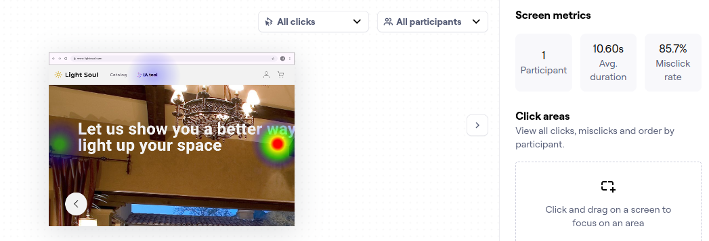
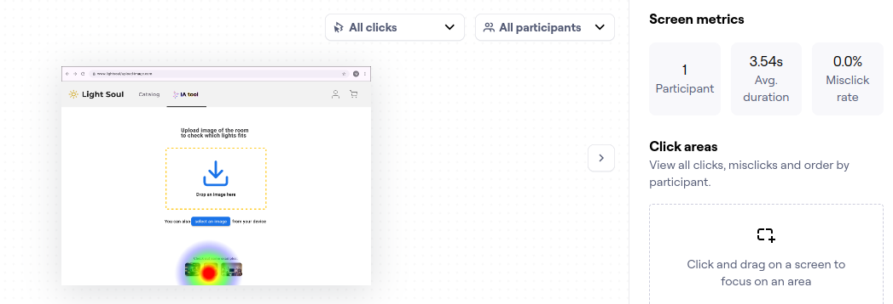
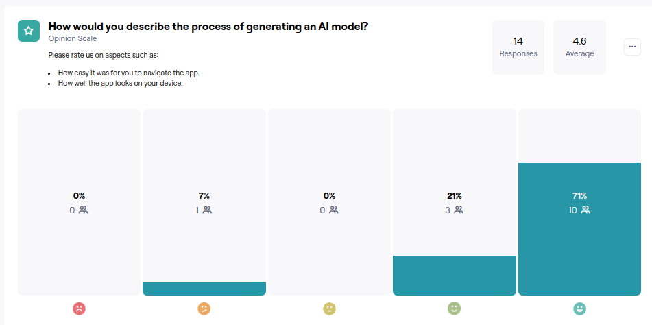
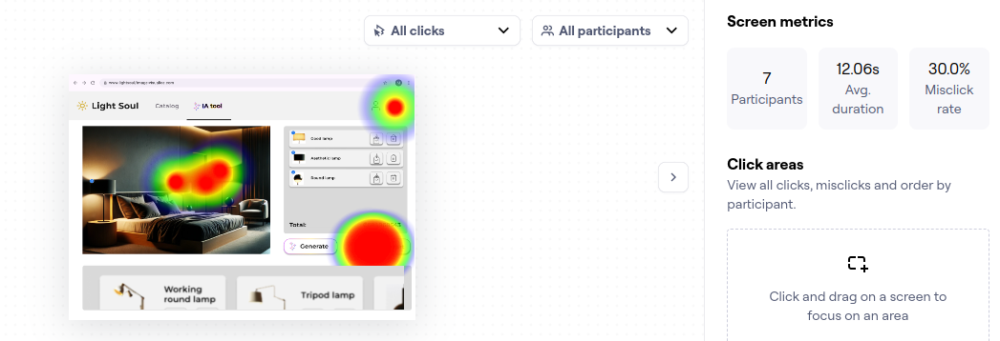

# Caso 2: Diseño

## Participantes

- Alfredo Enrique Mercado Ríos, 2023377984
- Andrés Salas Araya, 2019041994
- Josué David Echeverría Pérez, 2022093947
- Samir Cabrera Tabash, 2022161229

## Introducción 

A continuación, se presenta el trabajo realizado para el caso 2 del curso de Diseño de Software, en el que se colabora con la empresa Light House para implementar el diseño de su nuevo feature de generación de imágenes utilizando herramientas de IA. Se mostrarán los resultados del diseño en Figma y los resultados de las pruebas de diseño realizadas con la herramienta Maze.

### Herramientas

- **Figma**: Software de diseño utilizado para la construcción de las pantallas, sus conexiones, además de realizar pruebas de interacción.
- **Maze**: Software de testing para diseño, utilizado para crear formularios que permiten evaluar los diseños propuestos por el equipo de UI/UX antes de su lanzamiento a producción.

## Diseño

[Link a Figma](https://www.figma.com/design/IrxBEeqi7OEhi7QPYSCSQY/Lamp-IA-Feature?node-id=106-590&node-type=FRAME&t=8d5QSr4Ay6TZGToj-0)

A continuación, se muestra una serie de pantallas de Figma:

Primero, al ingresar, se realizó un rediseño de la página web para mantener una visualización más limpia:

Luego, al hacer clic en el botón de "IA Tool", se redirige al inicio de la herramienta, donde se ofrece la opción de interactuar con la IA utilizando imágenes propias del computador o con algunas imágenes de referencia suministradas por el equipo de Light House.

Seguidamente, ingresamos al sistema de visualización. En la parte izquierda, vemos un recuadro con la imagen suministrada junto con los elementos generados por la IA. A la derecha, se visualiza un espacio donde se pueden ver todos los productos añadidos a la imagen. Cada producto, tanto dentro de la imagen como en el espacio de visualización de objetos, está etiquetado con un número de ítem. En la parte inferior de la pantalla, hay un catálogo para que los usuarios puedan cambiar productos o agregar otros. Además, se encuentran dos botones: uno para seguir generando nuevas imágenes de IA y otro para agregar los ítems al carrito.

Se presentan dos sets de imágenes generadas por la IA: uno en un cuarto y otro en una sala. Presta atención a las diferencias generadas por la IA.

**Cuarto:**

**Sala:**

Posteriormente, se muestra una vista del carrito al hacer clic en el botón correspondiente.

Una vez seleccionado el contenido del carrito, se puede proceder a la página de checkout.

Dado que la funcionalidad de generación de IA es muy directa, su diseño también lo es. Se optó por un enfoque minimalista para facilitar la interacción del usuario.

## Testing 

El testing se llevó a cabo utilizando la herramienta Maze. [Link a Maze](https://app.maze.co/projects/275813975)

### Imágenes del Testing

A continuación, se muestra una serie de imágenes del testing, que incluyen información básica sobre el programa de IA y algunas preguntas después de cada prueba para obtener feedback sobre nuestro trabajo.

### Sujetos de Prueba 

Se logró alcanzar a 16 personas para el día de la entrega del proyecto, el 30 de agosto de 2024. Este resultado se consiguió compartiendo la encuesta de Maze en redes sociales, y fue realizada de manera anónima. No se definió un público objetivo, ya que Light House pretende que cualquier persona pueda usar la plataforma, por lo que este valor se omitió.

### Resultados de Prueba 

En Maze se definieron solo dos pruebas:

1. Entrar al generador de imágenes IA y probar su funcionalidad.
2. Proceder al carrito y realizar el checkout.

Solo se realizaron dos pruebas porque el sistema no tiene más funcionalidades principales que requieran testing.

#### Resultados de Prueba 1 

Para realizar este test, se definieron distintos caminos de éxito en la aplicación, ya que incluye la opción de cargar archivos o usar las imágenes de referencia proporcionadas.

##### Resultados 

##### Mapa de Calor

Se presentan los resultados del heatmap con el camino de selección de archivos. Se pueden apreciar los puntos donde los usuarios realizaron más clics.

Seguidamente, se muestran los resultados del heatmap con el camino de selección de imágenes de prueba precargadas. Aquí también se pueden ver las zonas más visitadas de nuestra pantalla.

##### Opinion Check

#### Resultados de Prueba 2

##### Resultados 
En esta sección se observa la cantidad de encuestas finalizadas o no, y se incluye el tiempo promedio de respuesta.

##### Mapa de Calor

Se presentan los resultados del mapa de calor de la prueba 2, en los cuales se puede observar que los usuarios exploraron cada botón de la página para verificar si había alguna funcionalidad adicional.

##### Opinion Check

### Comentarios 

### Correcciones 

Para mejorar este prototipo, se deben realizar las siguientes acciones:
- Resaltar las áreas de importancia, como los botones, con colores más vibrantes para que el usuario no se pierda durante su interacción con la IA de lámparas.
- Agregar más funcionalidades a los botones, ya que se recibió un comentario relacionado con la falta de funcionalidad de algunos botones. Esto se hizo así por cuestiones del test.
- Incluir la funcionalidad de quitar o cambiar lámparas, permitiendo a los usuarios acceder al catálogo de manera más interactiva.

## Conclusiones

Al realizar este proyecto, nos dimos cuenta del impacto de la IA en nuestras vidas y tambien la ayuda que genera para un negocio, en este caso Light House obtiene un servicio de vital importancia, esta herramienta les ayudara a poder generar imagenes de referencia que haran que sus ventas se multipliquen. A su vez para los clientes este servicio nos ayudara a darnos una idea real de como se veria las lamparas en caso de comprarlas, ayudando a tomar la desicion. 
Por ambos lados vemos un benificio gracias a las tecnologias, a demas si se tiene en cuenta que tiene un diseno con un buen recibimiento de parte del publico usuario, esto ayudara aun mas al servicio y a la tienda.
