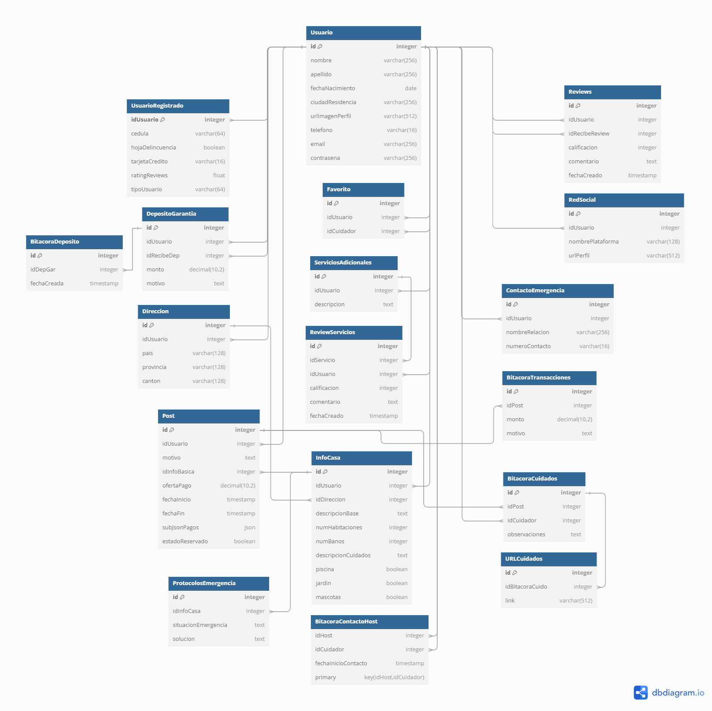

# HACE FALTA LO DE RESTRICCIONES


Para cada tabla o collection, escriba un ejemplo de la data que tendría esa entidad. Finalmente pegue en el canal de general el modelo de datos como imagen y los ejemplos de data de cada una. Si es nonSQL, entonces el diseño y los datos ejemplos será un json ejemplo de cada collection, con comentarios donde se ocupe aclarar alguna restricción.

# Datos
A continuación, se muestra el cuerpo base de cada tabla:
### PostgreSQL
### 1. Usuario
| Campo               | Tipo de Dato     |
|---------------------|------------------|
| `id`                | `INTEGER`        |
| `nombre`            | `VARCHAR(256)`   |
| `apellido`          | `VARCHAR(256)`   |
| `fechaNacimiento`   | `DATE`           |
| `ciudadResidencia`  | `VARCHAR(256)`   |
| `urlImagenPerfil`   | `VARCHAR(512)`   |
| `telefono`          | `VARCHAR(16)`    |
| `email`             | `VARCHAR(256)`   |
| `contrasena`        | `VARCHAR(256)`   |

### 2. Usuario Registrado
| Campo               | Tipo de Dato     |
|---------------------|------------------|
| `idUsuario`         | `INTEGER`        |
| `cedula`            | `VARCHAR(64)`    |
| `hojaDelincuencia`  | `BOOLEAN`        |
| `tarjetaCredito`    | `VARCHAR(16)`    |
| `ratingReviews`     | `FLOAT`          |
| `tipoUsuario`       | `VARCHAR(64)`    |

### 3. Reviews
| Campo               | Tipo de Dato     |
|---------------------|------------------|
| `id`                | `INTEGER`        |
| `idUsuario`         | `INTEGER`        |
| `idRecibeReview`    | `INTEGER`        |
| `calificacion`      | `INTEGER`        |
| `comentario`        | `TEXT`           |
| `fechaCreado`       | `TIMESTAMP`      |

### 4. Red Social
| Campo               | Tipo de Dato     |
|---------------------|------------------|
| `id`                | `INTEGER`        |
| `idUsuario`         | `INTEGER`        |
| `nombrePlataforma`  | `VARCHAR(128)`   |
| `urlPerfil`         | `VARCHAR(512)`   |

### 5. Depósito de Garantía
| Campo               | Tipo de Dato     |
|---------------------|------------------|
| `id`                | `INTEGER`        |
| `idUsuario`         | `INTEGER`        |
| `idRecibeDep`       | `INTEGER`        |
| `monto`             | `DECIMAL(10,2)`  |
| `motivo`            | `TEXT`           |

### 6. Bitácora Depósito
| Campo               | Tipo de Dato     |
|---------------------|------------------|
| `id`                | `INTEGER`        |
| `idDepGar`          | `INTEGER`        |
| `fechaCreada`       | `TIMESTAMP`      |

### 7. Servicios Adicionales
| Campo               | Tipo de Dato     |
|---------------------|------------------|
| `id`                | `INTEGER`        |
| `idUsuario`         | `INTEGER`        |
| `descripcion`       | `TEXT`           |

### 8. Review Servicios
| Campo               | Tipo de Dato     |
|---------------------|------------------|
| `id`                | `INTEGER`        |
| `idServicio`        | `INTEGER`        |
| `idUsuario`         | `INTEGER`        |
| `calificacion`      | `INTEGER`        |
| `comentario`        | `TEXT`           |
| `fechaCreado`       | `TIMESTAMP`      |

### 9. Dirección
| Campo               | Tipo de Dato     |
|---------------------|------------------|
| `id`                | `INTEGER`        |
| `idUsuario`         | `INTEGER`        |
| `pais`              | `VARCHAR(128)`   |
| `provincia`         | `VARCHAR(128)`   |
| `canton`            | `VARCHAR(128)`   |

### 10. Contacto de Emergencia
| Campo               | Tipo de Dato     |
|---------------------|------------------|
| `id`                | `INTEGER`        |
| `idUsuario`         | `INTEGER`        |
| `nombreRelacion`    | `VARCHAR(256)`   |
| `numeroContacto`    | `VARCHAR(16)`    |

### 11. Bitácora de Transacciones
| Campo               | Tipo de Dato     |
|---------------------|------------------|
| `id`                | `INTEGER`        |
| `idPost`            | `INTEGER`        |
| `monto`             | `DECIMAL(10,2)`  |
| `motivo`            | `TEXT`           |

### 12. Bitácora de Cuidados
| Campo               | Tipo de Dato     |
|---------------------|------------------|
| `id`                | `INTEGER`        |
| `idPost`            | `INTEGER`        |
| `idCuidador`        | `INTEGER`        |
| `observaciones`     | `TEXT`           |

### 13. URL de Cuidados
| Campo               | Tipo de Dato     |
|---------------------|------------------|
| `id`                | `INTEGER`        |
| `idBitacoraCuido`   | `INTEGER`        |
| `link`              | `VARCHAR(512)`   |

### 14. Protocolos de Emergencia
| Campo               | Tipo de Dato     |
|---------------------|------------------|
| `id`                | `INTEGER`        |
| `idInfoCasa`        | `INTEGER`        |
| `situacionEmergencia` | `TEXT`         |
| `solucion`          | `TEXT`           |

### 15. Favorito
| Campo               | Tipo de Dato     |
|---------------------|------------------|
| `id`                | `INTEGER`        |
| `idUsuario`         | `INTEGER`        |
| `idCuidador`        | `INTEGER`        |


### 16. Bitácora Contacto Host
| Campo               | Tipo de Dato     |
|---------------------|------------------|
| `idHost`            | `INTEGER`        |
| `idCuidador`        | `INTEGER`        |
| `fechaInicioContacto` | `TIMESTAMP`    |

--------------------------------------------------------------
## MongoDB

### 17. Info Casa
| Campo               | Tipo de Dato     |
|---------------------|------------------|
| `id`                | `INTEGER`        |
| `idUsuario`         | `INTEGER`        |
| `idDireccion`       | `INTEGER`        |
| `descripcionBase`   | `TEXT`           |
| `numHabitaciones`   | `INTEGER`        |
| `numBanos`          | `INTEGER`        |
| `descripcionCuidados` | `TEXT`         |
| `piscina`           | `BOOLEAN`        |
| `jardin`            | `BOOLEAN`        |
| `mascotas`          | `BOOLEAN`        |

### 18. Post
| Campo               | Tipo de Dato     |
|---------------------|------------------|
| `id`                | `INTEGER`        |
| `idUsuario`         | `INTEGER`        |
| `motivo`            | `TEXT`           |
| `idInfoBasica`      | `INTEGER`        |
| `ofertaPago`        | `DECIMAL(10,2)`  |
| `fechaInicio`       | `TIMESTAMP`      |
| `fechaFin`          | `TIMESTAMP`      |
| `subJsonPagos`      | `JSON`           |
| `estadoReservado`   | `BOOLEAN`        |

- Sub-json Pagos
```
{
  "pagos": [
    {
      "id": 0,
      "asunto": "",
      "fecha": "",
      "monto": 0.0,
      "descripcionTipoPago": ""
    }
  ]
}

# Modelo de base de datos
Seguidamente se presenta el diagrama que corresponde a las tablas mencionadas anteriormente.



### Modelo NoSQL
```
{
  "_id": "string",               
  "idUsuario": "integer",        
  "motivo": "string",            
  "idInfoBasica": "integer",     
  "ofertaPago": "decimal",       
  "fechaInicio": "timestamp",    
  "fechaFin": "timestamp",      
  "subJsonPagos": {},            // Subdocumento para detalles de pagos (puede ser un objeto vacío o tener información)
  "estadoReservado": "boolean"   
}
{
  "_id": "string",               
  "idUsuario": "integer",        
  "idDireccion": "integer",      
  "descripcionBase": "string",   
  "numHabitaciones": "integer",
  "numBanos": "integer",       
  "descripcionCuidados": "string", 
  "piscina": "boolean",          
  "jardin": "boolean",           
  "mascotas": "boolean"       
}
```

# Restricciones de las Tablas

# Ejemplos
```
------ POSGRESQL ------
{
  "Usuario": [
    {
      "id": 1,
      "nombre": "Juan",
      "apellido": "Pérez",
      "fechaNacimiento": "1985-05-15",
      "ciudadResidencia": "Madrid",
      "urlImagenPerfil": "http://example.com/imagen.jpg",
      "telefono": "123456789",
      "email": "juan@example.com",
      "contrasena": "contraseña123"
    }
  ],
  "UsuarioRegistrado": [
    {
      "idUsuario": 1,
      "cedula": "V-12345678",
      "hojaDelincuencia": false,
      "tarjetaCredito": "1234-5678-9012-3456",
      "ratingReviews": 4.5,
      "tipoUsuario": "Cuidador"
    }
  ],
  "Reviews": [
    {
      "id": 1,
      "idUsuario": 1,
      "idRecibeReview": 1,
      "calificacion": 5,
      "comentario": "Excelente servicio!",
      "fechaCreado": "2024-10-01T12:00:00Z"
    }
  ],
  "RedSocial": [
    {
      "id": 1,
      "idUsuario": 1,
      "nombrePlataforma": "Facebook",
      "urlPerfil": "http://facebook.com/juan.perez"
    }
  ],
  "DepositoGarantia": [
    {
      "id": 1,
      "idUsuario": 1,
      "idRecibeDep": 1,
      "monto": 200.00,
      "motivo": "Depósito para reservas"
    }
  ],
  "BitacoraDeposito": [
    {
      "id": 1,
      "idDepGar": 1,
      "fechaCreada": "2024-10-01T12:30:00Z"
    }
  ],
  "ServiciosAdicionales": [
    {
      "id": 1,
      "idUsuario": 1,
      "descripcion": "Cuidado de mascotas"
    }
  ],
  "ReviewServicios": [
    {
      "id": 1,
      "idServicio": 1,
      "idUsuario": 1,
      "calificacion": 5,
      "comentario": "Servicio excelente, muy recomendable.",
      "fechaCreado": "2024-10-01T12:00:00Z"
    }
  ],
  "Direccion": [
    {
      "id": 1,
      "idUsuario": 1,
      "pais": "España",
      "provincia": "Madrid",
      "canton": "Madrid"
    }
  ],
  "ContactoEmergencia": [
    {
      "id": 1,
      "idUsuario": 1,
      "nombreRelacion": "Hermano",
      "numeroContacto": "987654321"
    }
  ],
  "BitacoraTransacciones": [
    {
      "id": 1,
      "idPost": 1,
      "monto": 150.00,
      "motivo": "Pago por servicio"
    }
  ],
  "BitacoraCuidados": [
    {
      "id": 1,
      "idPost": 1,
      "idCuidador": 1,
      "observaciones": "Se siguieron todas las instrucciones."
    }
  ],
  "URLCuidados": [
    {
      "id": 1,
      "idBitacoraCuido": 1,
      "link": "http://example.com/instrucciones"
    }
  ],
  "ProtocolosEmergencia": [
    {
      "id": 1,
      "idInfoCasa": 1,
      "situacionEmergencia": "Incendio",
      "solucion": "Llamar al 112 y evacuar el edificio."
    }
  ],
  "Favorito": [
    {
      "id": 1,
      "idUsuario": 1,
      "idCuidador": 1
    }
  ],

------ MONGO DB ------

  "InfoCasa": [
    {
      "id": 1,
      "idUsuario": 1,
      "idDireccion": 1,
      "descripcionBase": "Casa acogedora en el centro de Madrid",
      "numHabitaciones": 3,
      "numBanos": 2,
      "descripcionCuidados": "Ideal para familias y mascotas",
      "piscina": false,
      "jardin": true,
      "mascotas": true
    }
  ],
  "Post": [
    {
      "id": 1,
      "idUsuario": 1,
      "motivo": "Necesito un cuidador para mi mascota",
      "idInfoBasica": 1,
      "ofertaPago": 100.00,
      "fechaInicio": "2024-10-05T00:00:00Z",
      "fechaFin": "2024-10-12T00:00:00Z",
      "subJsonPagos": {},
      "estadoReservado": false
    }
  ]
}
```