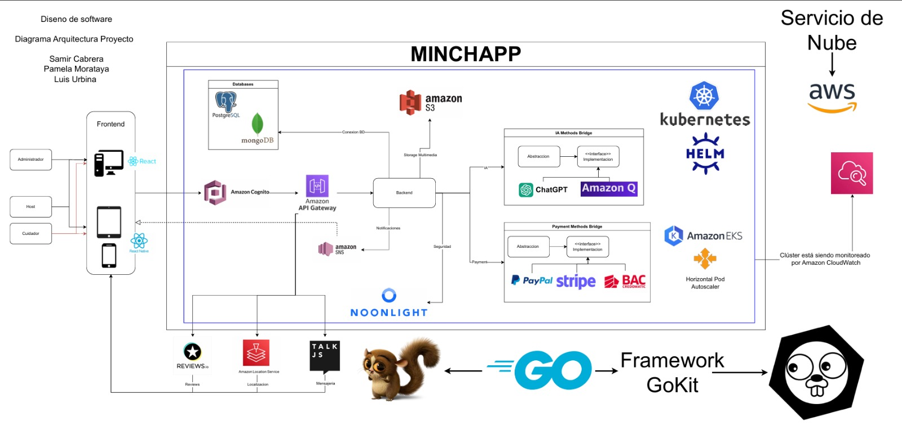

# Minchapp 🐾

# Marca

Cuidado confiable, conexiones seguras

Nuestro lema: "Tranquilidad para ti, amor para tu mascota"

## Descripción del Proyecto

Minchapp es una plataforma innovadora diseñada para conectar a dueños de mascotas con cuidadores confiables. El proyecto está dirigido a todos aquellos dueños de mascotas que no tienen con quien dejar a su mascota a la hora de salir de viaje. Nuestra plataforma busca facilitar el cuidado de las mascotas, así como proporcionar una solución para personas que van a salir de viaje y necesiten cuido de casas centrandonos en cuidado de mascotas.

## Requerimientos de Alto Nivel

### Prioridad 1

#### Host
- Publicación de necesidad de cuido (incluir garantías)
- Aceptación o negación de request de cuido
- Desembolsos de cuido
- Cancelar el contrato o servicio

#### Cuidador
- Visualizar opciones de cuido
- Request de cuido (incluir precio opcional, incluir cosas que pueden hacer, ej: grooming)
- Cancelar contrato o servicio

#### Sistema
- Registro de usuarios (host/cuidador)
- Verificador de identidad (hoja de delincuencia, CV)
- Contrato host - cuidador
- Método de pago
- Protocolos de seguridad (alertas, emergencias)
- Seguros (INS, etc...)
- Comprobación de servicios para realizar el pago de manera correcta (trabajo terminado)

#### Administrador del Sistema
- Aprobación de publicación
- Administración de usuarios
- Cargos, cobros, transferencias
- Monitorear transacciones
- Monitorear solicitudes
- Aprobación de un cuidador

### Prioridad 2

#### Host
- Visualizar perfil del cuidador que mandó el request
- Aprobar petición económica de emergencia

#### Cuidador
- Feed personal con contenido (videos, fotos, certificados, trabajos...)
- Zona de trabajo
- Petición económica de emergencia (ej: dinero para el veterinario)

#### Sistema
- Chat host-cuidador
- Reclamos
- Equipo de seguridad

### Prioridad 3

#### Sistema
- Reseñas del host y cuidador
- Categorizar tipos de cuidos

## Diagrama de Arquitectura

## Problem Statement
- Revisión / Proceso de aceptación del perfil del cuidador

