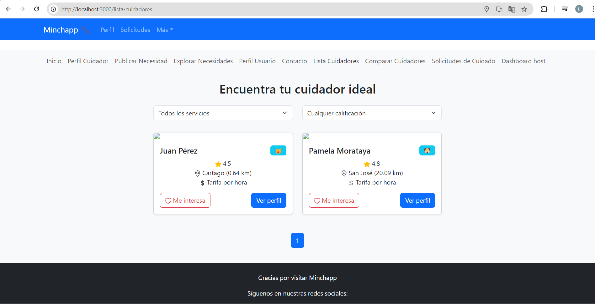
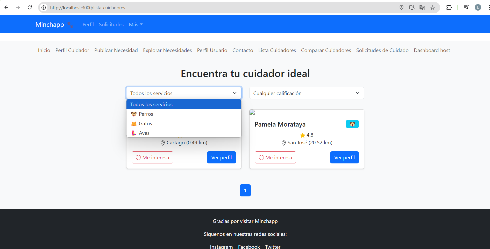
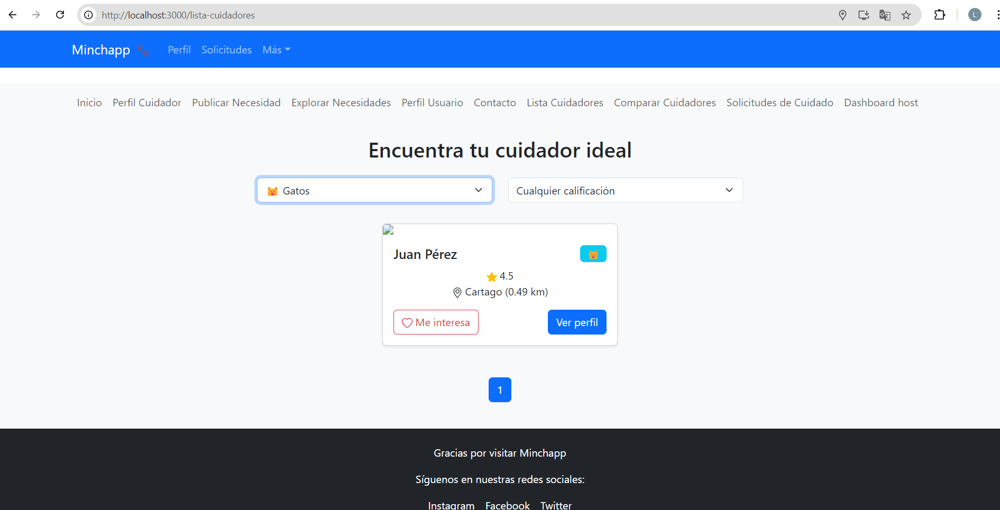
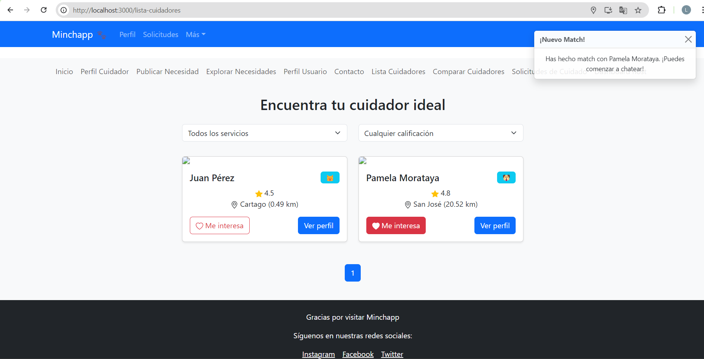
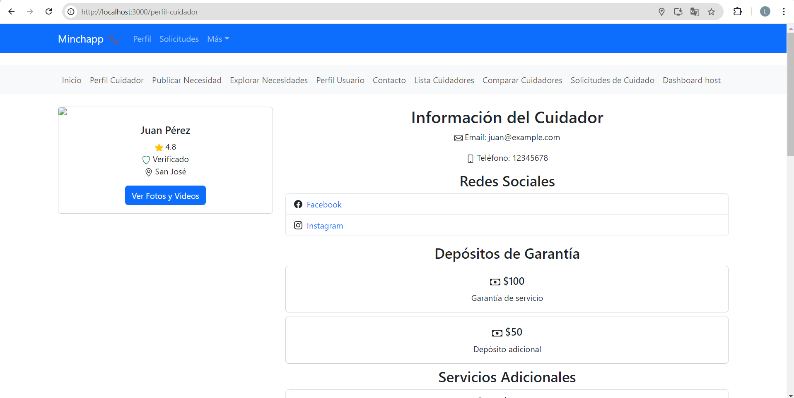

# Getting Started with Create React App

This project was bootstrapped with [Create React App](https://github.com/facebook/create-react-app).

## Available Scripts

In the project directory, you can run:

### `npm start`

Runs the app in the development mode.\
Open [http://localhost:3000](http://localhost:3000) to view it in the browser.

The page will reload if you make edits.\
You will also see any lint errors in the console.

### `npm test`

Launches the test runner in the interactive watch mode.\
See the section about [running tests](https://facebook.github.io/create-react-app/docs/running-tests) for more information.

### `npm run build`

Builds the app for production to the `build` folder.\
It correctly bundles React in production mode and optimizes the build for the best performance.

The build is minified and the filenames include the hashes.\
Your app is ready to be deployed!

See the section about [deployment](https://facebook.github.io/create-react-app/docs/deployment) for more information.

### `npm run eject`

**Note: this is a one-way operation. Once you `eject`, you can’t go back!**

If you aren’t satisfied with the build tool and configuration choices, you can `eject` at any time. This command will remove the single build dependency from your project.

Instead, it will copy all the configuration files and the transitive dependencies (webpack, Babel, ESLint, etc) right into your project so you have full control over them. All of the commands except `eject` will still work, but they will point to the copied scripts so you can tweak them. At this point you’re on your own.

You don’t have to ever use `eject`. The curated feature set is suitable for small and middle deployments, and you shouldn’t feel obligated to use this feature. However we understand that this tool wouldn’t be useful if you couldn’t customize it when you are ready for it.

## Learn More

You can learn more in the [Create React App documentation](https://facebook.github.io/create-react-app/docs/getting-started).

To learn React, check out the [React documentation](https://reactjs.org/).

----------------------------------------------------------------------------------------------------

# MinchappFE

Este directorio contiene todos los componentes y lógica del frontend de la aplicación Minchapp.

## Estructura

- components/: Componentes reutilizables de React
  - common/: Componentes comunes utilizados en toda la aplicación
  - cuidadores/: Componentes específicos para la funcionalidad de cuidadores
  - host/: Componentes específicos para la funcionalidad de hosts
  - profile/: Componentes relacionados con perfiles de usuario

- pages/: Componentes de página completa
- hooks/: Hooks personalizados 
- services/: Funciones para interactuar con APIs
- utils/: Funciones de utilidad
- styles/: Estilos globales y variables
- assets/: Archivos estáticos (imágenes, fuentes)
- context/: Contextos de React para compartir información entre componentes
- redux/: Configuración para manejar la información compartida en toda la aplicación
  - slices/: Partes individuales de la información compartida
  - store.ts: Archivo principal que organiza toda la información compartida


- types/: Definiciones de tipos TypeScript

## Descargar dependencias

Creamo el proyecto con typescript
```
npx create-react-app minchapp --template typescript
```
En la carpeta minchapp instalamos bootstrap
```
cd minchapp
npm install bootstrap@5.3.3
npm install react-bootstrap @types/react-bootstrap
npm install react-bootstrap-icons
npm install react-router-dom


```	
Para implementar el patrón Observer y manejar el estado global de manera más eficiente,Redux:
```
npm install redux react-redux @reduxjs/toolkit
```

Para manejar las peticiones HTTP:
```
npm install axios
```

Para la validación de formularios:
```
npm install formik yup
```

Para manejar fechas:
```
npm install date-fns
```

Para implementar mapas y geolocalización:
```
npm install react-leaflet leaflet
```

Para implementar infinite scrolling en las listas:
```
npm install react-infinite-scroll-component
```


# Matriz de Requerimientos vs Componentes Visuales

| Requerimiento                                          | ListaCuidadores | PerfilCuidador | ComparacionCuidadores | FormularioContacto | DashboardHost | PublishCareNeed | NotificacionesCuidadores | ChatComponent |
|--------------------------------------------------------|-----------------|----------------|----------------------|---------------------|---------------|-----------------|--------------------------|---------------|
| Visualizar información de cuidadores                   | X               | X              | X                    |                     |               |                 |                          |               |
| Ver detalles de cuidadores                             |                 | X              |                      |                     |               |                 |                          |               |
| Crear vínculo con el dueño de la casa                  |                 | X              |                      | X                   |               |                 |                          |               |
| Mostrar media de los cuidadores                        |                 | X              |                      |                     |               |                 |                          |               |
| Mostrar redes sociales de cuidadores                   |                 | X              |                      |                     |               |                 |                          |               |
| Mostrar reviews y testimonios                          |                 | X              |                      |                     |               |                 |                          |               |
| Mostrar depósitos de garantía                          |                 | X              |                      |                     |               |                 |                          |               |
| Mostrar rates de cuidadores                            | X               | X              | X                    |                     |               |                 |                          |               |
| Mostrar hoja de delincuencia                           |                 | X              |                      |                     |               |                 |                          |               |
| Integración con IA para recomendaciones                | X               |                |                      |                     |               |                 |                          |               |
| Geolocalización y cálculo de distancia                 | X               |                |                      |                     |               |                 |                          |               |
| Mostrar facilidades y credenciales                     |                 | X              | X                    |                     |               |                 |                          |               |
| Paginación de resultados                               | X               |                |                      |                     |               |                 |                          |               |
| Marcar cuidadores como favoritos                       | X               |                |                      |                     | X             |                 |                          |               |
| Enviar solicitud de contacto                           |                 |                |                      | X                   |               |                 |                          |               |
| Publicar necesidad de cuidado                          |                 |                |                      |                     | X             | X               |                          |               |
| Gestionar solicitudes de cuidadores                    |                 |                |                      |                     | X             |                 | X                        |               |
| Visualizar publicaciones activas                       |                 |                |                      |                     | X             |                 |                          |               |
| Comunicarse con cuidadores                             |                 |                |                      |                     |               |                 |                          | X             |
| Gestionar perfil de usuario                            |                 |                |                      |                     | X             |                 |                          |               |
| Visualizar y gestionar cuidadores favoritos            |                 |                |                      |                     | X             |                 |                          |               |
| Ver notificaciones de cuidadores interesados           |                 |                |                      |                     |               |                 | X                        |               |
| Aceptar o rechazar solicitudes de cuidadores           |                 |                |                      |                     |               |                 | X                        |               |


-----------------------------------------
# Pantallas

Apuntes de las pantallas que creo que se van a necesitar para lo que es el alcance del proyecto. 

## 1. Pantalla de busqueda de Cuidadores

Busqueda de cuidadores - (Feed de cuidadores) (ya)

Incluir geolocalizacion y posiblemente calculo tambien de distancia (ya)


## 2. Perfil del Cuidador
Informacion detallada del cuidador para generar confianza rapido

Reviews del mae a simple vista (falta mejorar la vista pero ahi esta)

Mostrar verificaciones (Como si tiene hoja de delicuencia o algo asi) (ya)

Sistema de like/favoritos (No se si hacer una pantalla dedicada a esto, o mejor tirarlo por encima)

## 3. Comparacion de Cuidadores

Para comparar a varios cuidadores a la vez (ya)

## 4. Post de Necesidad de Cuidado 

Formulario para el post (falta mejorar para que se vea mas amigable)

Detalles de la casa, mascotas, y servicios que necesita (ya)

## 5. Dashboard del Host

Mostrar posts activos 

mostar solicitudes de cuidadores interesados (ya)

Ver el perfil de los cuidadores (ya pero falta hacerlo mas bonito)

## 6. Chat entre Host y Cuidador

Pantallita de cuando hacen match 

chat de la conversacion

# Documentación de Pantallas de Minchapp

## 1. Pantalla de Búsqueda de Cuidadores (ListaCuidadores)



### Descripción
Esta pantalla muestra un feed de cuidadores disponibles, permitiendo a los usuarios buscar y filtrar cuidadores según las necesidades del host. 

### Funcionalidades
- Lista de cuidadores con información básica (nombre, foto, calificación, especialidades)
- Filtros de búsqueda (por tipo de mascota o servico, y por calificacion)
- Geolocalización y cálculo de distancia
- Sistema de paginación 

### Acciones del Usuario
- Aplicar filtros de búsqueda (Ejemplo busqueda por servicios para gatos)


- Visualiar los cuidadores ya filtrados (Ejemplo con servicios para gatos)


- Ver perfil detallado de un cuidador 

( Me falta dirigir y mostrar el perfil del cuidador seleccionado aca)

- Marcar cuidadores como favoritos



### Mensajes y Notificaciones
Cuando se aplica un filtro y no hay matches con respecto a eso pienso poner: 
- "No se encontraron cuidadores que coincidan con tus criterios de búsqueda"

Perdir acceso a la ubicacion para poder hacer el calculo de distancia
- "Permitir acceso a tu ubicación para mostrar cuidadores cercanos"

Cuando ambos se dan like (Tipo Tinder)
- "!Nuevo Match¡ Has hecho match con Pamela Morataya. ¡Puedes comenzar a chatear!"

## 2. Perfil del Cuidador (PerfilCuidador)



### Descripción
Muestra información detallada sobre un cuidador específico, incluyendo sus calificaciones, experiencia y verificaciones.

### Funcionalidades
- Información personal del cuidador
- Galería de fotos y videos
- Lista de servicios ofrecidos
- Calificaciones y reseñas de otros usuarios
- Verificaciones (hoja de delincuencia, certificaciones)

### Acciones del Usuario
- Contactar al cuidador
- Dejar una reseña (si ya ha utilizado sus servicios)

### Mensajes y Notificaciones
- "Cuidador verificado" (badge)
- "¿Estás seguro de que quieres contactar a este cuidador?" (confirmación)

## 3. Comparación de Cuidadores (ComparacionCuidadores)

### Descripción
Permite a los usuarios comparar varios cuidadores lado a lado para facilitar la toma de decisiones.

### Funcionalidades
- Tabla comparativa de cuidadores (hasta 3 o 4)
- Comparación de servicios, calificaciones y experiencia

### Acciones del Usuario
- Seleccionar cuidadores para comparar
- Ver perfil completo de un cuidador

### Mensajes y Notificaciones
- "Selecciona al menos dos cuidadores para comparar"
- "Has alcanzado el máximo de cuidadores para comparar"

## 4. Publicación de Necesidad de Cuidado (PublishCareNeed)


### Descripción
Formulario para que los hosts publiquen una nueva necesidad de cuidado.

### Funcionalidades
- Formulario detallado para describir la necesidad de cuidado
- Sección para detalles de la casa y mascotas
- Especificación de servicios requeridos
- Selección de fechas y duración del servicio

### Acciones del Usuario
- Completar y enviar el formulario
- Subir fotos de la casa y mascotas
- Especificar preferencias de cuidador

### Mensajes y Notificaciones
- "Tu publicación ha sido creada exitosamente"
- "Por favor completa todos los campos requeridos" (mensaje de error)

## 5. Dashboard del Host (DashboardHost)

### Descripción
Panel de control para que los hosts gestionen sus publicaciones activas y vean las solicitudes de cuidadores interesados.

### Funcionalidades
- Lista de publicaciones activas
- Solicitudes de cuidadores interesados

### Acciones del Usuario
- Ver detalles de publicaciones
- Revisar perfiles de cuidadores interesados
- Aceptar o rechazar solicitudes
- Editar o cancelar publicaciones

### Mensajes y Notificaciones
- "Tienes X nuevas solicitudes de cuidadores"
- "¿Estás seguro de que quieres cancelar esta publicación?"

## 6. Chat entre Host y Cuidador (ChatComponent)


### Descripción
Interfaz de chat para la comunicación directa entre hosts y cuidadores.

### Funcionalidades
- Mensajería en tiempo real
- Historial de conversaciones

### Acciones del Usuario
- Enviar y recibir mensajes
- Ver estado de lectura de mensajes

### Mensajes y Notificaciones
- "Nuevo mensaje de X"
- "Tu mensaje ha sido enviado"


