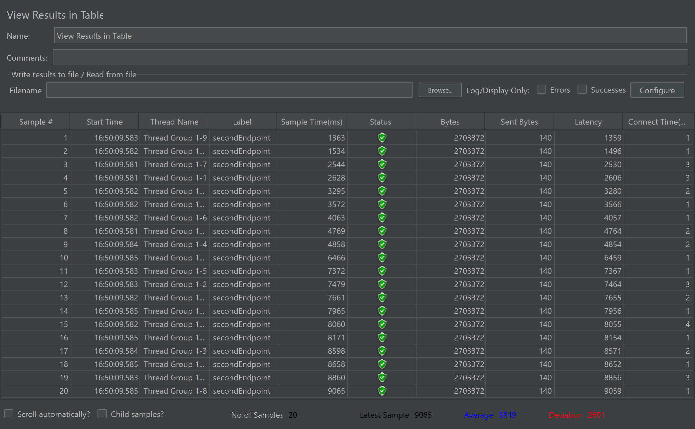
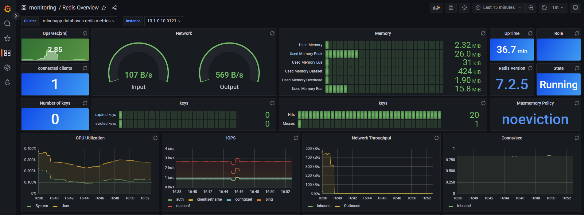

# Documentación del Microservicio Go

## Estructura del Proyecto

El proyecto está organizado en varios paquetes:

- `main.go`: Punto de entrada de la aplicación
- `internal/`: Contiene la lógica interna del servicio
  - `service/`: Define la interfaz del servicio y su implementación
  - `endpoint/`: Define los endpoints y las estructuras de solicitud/respuesta
  - `transport/`: Maneja la codificación/decodificación HTTP
- `pkg/`: Contiene paquetes reutilizables
  - `db/`: Maneja la conexión a la base de datos PostgreSQL
  - `cache/`: Maneja la conexión al cache Redis

## Componentes Principales

### 1. Main (`main.go`)

Este archivo es el punto de entrada de la aplicación. Sus principales funciones son:

- Inicializar las conexiones a la base de datos y al cache
- Crear una instancia del servicio
- Definir y configurar los endpoints
- Configurar los manejadores HTTP
- Iniciar el servidor HTTP

#### Flujo de ejecución:

1. Se establecen conexiones con PostgreSQL y Redis
2. Se crea una instancia del servicio utilizando estas conexiones
3. Se definen los endpoints utilizando la instancia del servicio
4. Se configuran los manejadores HTTP para cada endpoint
5. Se inicia el servidor HTTP en el puerto 8080

### 2. Service (`internal/service/service.go`)

Define la interfaz `Service` y su implementación `basicService`. Este componente contiene la lógica de negocio principal.

#### Métodos:

- `Get35PercentRecordsEndpoint`: Obtiene datos 
- `get-35-percent-with-pool`: Obtiene datos utilizando un pool de conexiones 
- `get-data-cache`: Obtiene datos del cache

### 3. Endpoints (`internal/endpoint/endpoints.go`)

Define la estructura de los endpoints y las funciones para crearlos. Utiliza el patrón de diseño "endpoint" de go-kit.

#### Endpoints definidos:

- `Get35PercentRecordsEndpoint`
- `get-35-percent-with-pool`
- `get-data-cache`

Cada endpoint toma una solicitud, la procesa utilizando el servicio, y devuelve una respuesta.

### 4. Transport (`internal/transport/http.go`)

Maneja la codificación y decodificación de las solicitudes y respuestas HTTP.

#### Funciones principales:

- `EncodeResponse`: Codifica la respuesta en formato JSON

### 5. Database (`pkg/db/db.go`)

Maneja la conexión a PostgreSQL. 

### 6. Cache (`pkg/cache/cache.go`)

Maneja la conexión a Redis.

## Flujo de una Solicitud

1. Una solicitud HTTP llega al servidor
2. El manejador HTTP correspondiente la procesa
3. El endpoint apropiado se ejecuta, llamando al método correspondiente del servicio
4. El servicio procesa la solicitud, interactuando con la base de datos o el cache según sea necesario
5. El resultado se envuelve en una respuesta
6. La respuesta se codifica usando `EncodeResponse` y se envía de vuelta al cliente

## Análisis de los Resultados de los Endpoints

### 1. get35PercentRecordsEndpoint (Primer Endpoint)

#### Tiempos de Respuesta
- Rango: 1608 ms - 21278 ms (20 muestras)
- Tiempo Promedio: 12539 ms
- Desviación Estándar: 5506 ms

#### Observación
Existe una variación significativa en los tiempos de respuesta, lo cual indica que el rendimiento del endpoint sin optimizacion puede ser inconsistente bajo carga.

### 2. get-35-percent-with-pool (Segundo Endpoint)

#### Tiempos de Respuesta
- Rango: 5787 ms - 16920 ms (20 muestras)
- Tiempo Promedio: 11832 ms
- Desviación Estándar: 2861 ms

#### Observación
Se observa una mejora en el tiempo de respuesta promedio respecto al primer endpoint, y la desviación también se disminuyo, lo cual indica que el uso de un connection pool está ayudando a mejorar la consistencia.

### 3. get-data-cache (Tercer Endpoint)

#### Tiempos de Respuesta
- Rango: 915 ms - 17173 ms (20 muestras)
- Tiempo Promedio: 7799 ms
- Desviación Estándar: 7156 ms

#### Observación
Este endpoint tiene el menor tiempo de respuesta promedio, lo cual muestra una mejora gracias al uso de la cache (Redis). Sin embargo, la desviación sigue siendo alta, lo cual puede deberse a varios factores, como la variabilidad de los datos en cache.

#### Análisis de los Resultados

| Endpoint | Tiempo Promedio (ms) | Desviación Estándar (ms) |
|----------|----------------------|--------------------------|
| Primero  | 12539                | 5506                     |
| Segundo  | 11832                | 2861                     |
| Tercero  | 7799                 | 7156                     |

## Conclusiones Cuantitativas

### 1. Impacto del Connection Pool
El segundo endpoint con el uso de connection pool muestra una mejora en el tiempo promedio de respuesta, pasando de 12539 ms a 11832 ms. La desviación también se reduce, señalando una mejor gestion de las conexiones. 

### 2. Impacto del Uso de Cache (Redis)
El tercer endpoint que incorpora Redis para la cache muestra un tiempo promedio 7799 ms, lo cual indica una mejora en el rendimiento. Esto es especialmente evidente para las solicitudes que pudieron ser atendidas con un cache hit, evitando la consulta completa a la base de datos.

### 3. Variabilidad en la Desviación Estándar
Aunque el tiempo promedio mejora al usar Redis, la desviación estándar del tercer endpoint sigue siendo relativamente alta (7156 ms). Esto indica que, aunque la cache ayuda a mejorar el rendimiento en general, existen ciertos casos en los que el acceso a la cache no es óptimo. 

## Metricas Recopiladas

Para cada uno de los contenedores de Michapp, se registraron las siguientes métricas:

- **CPU (%)**: Porcentaje de uso de la CPU.
- **Memoria Utilizada (MiB)**: Uso de memoria actual  vs el limite configurado.
- **Conexiones**: Conexiones activas en la base de datos.
- **PIDs**: Numero de procesos ejecutandose en el contenedor.

## Métricas por Componente

### 1. Conexiones a la Base de Datos (PostgreSQL)
**Contenedor**: minchapp-databases-postgresql-0
- **CPU**: Fluctuación de uso desde 0.58% a 16.86%.
- **Memoria**: Uso de memoria desde 11.2 MiB hasta 92.64 MiB (de un total de 192 MiB asignados).
- **PIDs**: Hasta 41 procesos simultáneos en ejecución.

### 2. Conexiones a Redis (Caché)
**Contenedores**: minchapp-databases-redis-replicas-0 y minchapp-databases-redis-master-0.
- **CPU (Redis Replicas)**: Variación de 0.00% a 8.15% de uso.
- **Memoria (Redis Replicas)**: Uso desde 10.02 MiB hasta 42.79 MiB.
- **CPU (Redis Master)**: Uso de CPU entre 0.00% y 12.54%.
- **Memoria (Redis Master)**: Uso entre 14.61 MiB y 60.22 MiB.
- **PIDs**: Hasta 17 procesos en ejecución.

## Análisis de Resultados
- **CPU**: Los contenedores del backend y la base de datos experimentaron picos de uso de CPU.
- **Memoria**: La utilización de memoria fue generalmente estable, con picos identificados en momentos de pruebas de carga intensiva.
- **PIDs**: Se noto un número elevado de procesos en PostgreSQL, lo cual es consistente con el aumento en el número de conexiones durante las pruebas de estrés.

## Tabulación de Resultados

| Componente           | CPU (%)       | Memoria Usada / Límite (MiB) | PIDs    |
|----------------------|---------------|------------------------------|---------|
| Redis Replicas       | 0.00% - 8.15% | 10.02 - 42.79 / 192          | 7 - 17  |
| Redis Master         | 0.00% - 12.54%| 14.61 - 60.22 / 192          | 7 - 11  |
| PostgreSQL           | 0.58% - 16.86%| 11.2 - 92.64 / 192           | 10 - 41 |

## Gráficas de Grafana
- Endpoint 1: En las gráficas de este endpoint se puede apreciar cómo el consumo del CPU es bastante elevado. Para la parte de uso de memoria se mantiene bastante moderado

- Endpoint 2: Ya en este endpoint podemos ver cómo el consumo de CPU

- Endpoint 3:

