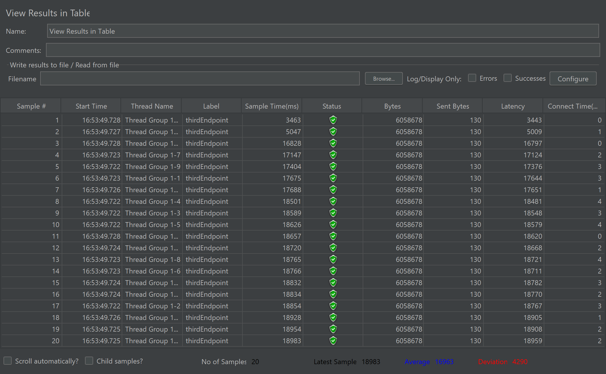

# Documentación del Microservicio Go

## Estructura del Proyecto

El proyecto está organizado en varios paquetes:

- `main.go`: Punto de entrada de la aplicación
- `internal/`: Contiene la lógica interna del servicio
  - `service/`: Define la interfaz del servicio y su implementación
  - `endpoint/`: Define los endpoints y las estructuras de solicitud/respuesta
  - `transport/`: Maneja la codificación/decodificación HTTP
- `pkg/`: Contiene paquetes reutilizables
  - `db/`: Maneja la conexión a la base de datos PostgreSQL
  - `cache/`: Maneja la conexión al cache Redis

## Componentes Principales

### 1. Main (`main.go`)

Este archivo es el punto de entrada de la aplicación. Sus principales funciones son:

- Inicializar las conexiones a la base de datos y al cache
- Crear una instancia del servicio
- Definir y configurar los endpoints
- Configurar los manejadores HTTP
- Iniciar el servidor HTTP

#### Flujo de ejecución:

1. Se establecen conexiones con PostgreSQL y Redis
2. Se crea una instancia del servicio utilizando estas conexiones
3. Se definen los endpoints utilizando la instancia del servicio
4. Se configuran los manejadores HTTP para cada endpoint
5. Se inicia el servidor HTTP en el puerto 8080

### 2. Service (`internal/service/service.go`)

Define la interfaz `Service` y su implementación `basicService`. Este componente contiene la lógica de negocio principal.

#### Métodos:

- `Get35PercentRecordsEndpoint`: Obtiene datos 
- `get-35-percent-with-pool`: Obtiene datos utilizando un pool de conexiones 
- `get-data-cache`: Obtiene datos del cache

### 3. Endpoints (`internal/endpoint/endpoints.go`)

Define la estructura de los endpoints y las funciones para crearlos. Utiliza el patrón de diseño "endpoint" de go-kit.

#### Endpoints definidos:

- `Get35PercentRecordsEndpoint`
- `get-35-percent-with-pool`
- `get-data-cache`

Cada endpoint toma una solicitud, la procesa utilizando el servicio, y devuelve una respuesta.

### 4. Transport (`internal/transport/http.go`)

Maneja la codificación y decodificación de las solicitudes y respuestas HTTP.

#### Funciones principales:

- `EncodeResponse`: Codifica la respuesta en formato JSON

### 5. Database (`pkg/db/db.go`)

Maneja la conexión a PostgreSQL. 

### 6. Cache (`pkg/cache/cache.go`)

Maneja la conexión a Redis.

## Flujo de una Solicitud

1. Una solicitud HTTP llega al servidor
2. El manejador HTTP correspondiente la procesa
3. El endpoint apropiado se ejecuta, llamando al método correspondiente del servicio
4. El servicio procesa la solicitud, interactuando con la base de datos o el cache según sea necesario
5. El resultado se envuelve en una respuesta
6. La respuesta se codifica usando `EncodeResponse` y se envía de vuelta al cliente

## Análisis de los Resultados de los Endpoints

### 1. get35PercentRecordsEndpoint (Primer Endpoint)

#### Tiempos de Respuesta
- Rango: 8329 ms - 29503 ms (20 muestras)
- Tiempo Promedio: 24627 ms
- Desviación Estándar: 6085 ms

#### Observación
Este endpoint muestra tiempos de respuesta muy altos y una gran variabilidad, lo que indica un rendimiento inconsistente y poco optimizado.

### 2. get-35-percent-with-pool (Segundo Endpoint)

#### Tiempos de Respuesta
- Rango: 1363 ms - 9065 ms (20 muestras)
- Tiempo Promedio: 5849 ms
- Desviación Estándar: 2601 ms

#### Observación
Se observa una mejora en el tiempo de respuesta promedio respecto al primer endpoint, y la desviación también se disminuyo, lo cual indica que el uso de un connection pool está ayudando a mejorar la consistencia.

### 3. get-data-cache (Tercer Endpoint)

#### Tiempos de Respuesta
- Rango: 3463 ms - 18983 ms (20 muestras)
- Tiempo Promedio: 16963 ms
- Desviación Estándar: 4290 ms

#### Observación
Este endpoint tiene el menor tiempo de respuesta promedio, lo cual muestra una mejora gracias al uso de la cache (Redis). Sin embargo, la desviación sigue siendo alta, lo cual puede deberse a varios factores, como la variabilidad de los datos en cache.

#### Análisis de los Resultados

| Endpoint | Tiempo Promedio (ms) | Desviación Estándar (ms) |
|----------|----------------------|--------------------------|
| Primero  | 24627                | 6085                     |
| Segundo  | 5849                 | 2601                     |
| Tercero  | 16963                | 4290                     |

## Conclusiones Cuantitativas

### 1. Impacto del Connection Pool
El segundo endpoint con el uso de connection pool muestra una mejora en el tiempo promedio de respuesta, pasando de 24627 ms a 5849 ms. La desviación estándar también se reduce, de 6085 ms a 2601 ms, lo que indica una mejor gestión de las conexiones y un rendimiento más consistente.

### 2. Impacto del Uso de Cache (Redis)
El tercer endpoint que incorpora Redis para la cache muestra un tiempo promedio de 16963 ms, lo cual indica una mejora comparado con el primer endpoint, pero no supera al segundo. Esto sugiere que el uso de cache puede ser beneficioso en ciertos escenarios, pero no siempre garantiza el mejor rendimiento.

### 3. Variabilidad en la Desviación Estándar
Aunque el tiempo promedio mejora al usar Redis comparado con el primer endpoint, la desviación estándar del tercer endpoint (4290 ms) sigue siendo alta, aunque menor que la del primer endpoint (6085 ms). Esto significa que usar cache mejora la velocidad, pero los tiempos de respuesta aún varían mucho. Esto puede ser porque algunos datos se encuentran más rápido en la cache que otros.

### 4. Comparación General
El segundo endpoint (con connection pool) muestra el mejor rendimiento general, con el tiempo de respuesta más bajo y la menor desviación estándar. Esto sugiere que la optimización de las conexiones a la base de datos tiene un impacto más significativo que el uso de cache en este caso particular.

## Metricas Recopiladas

Para cada uno de los contenedores de Michapp, se registraron las siguientes métricas:

- **CPU (%)**: Porcentaje de uso de la CPU.
- **Memoria Utilizada (MiB)**: Uso de memoria actual  vs el limite configurado.
- **Conexiones**: Conexiones activas en la base de datos.
- **PIDs**: Numero de procesos ejecutandose en el contenedor.

## Métricas por Componente

### 1. Base de Datos PostgreSQL
- **CPU (%)**: Fluctuación de uso desde 0.58% a 16.86%.
- **Memoria Utilizada (MiB)**: Uso de memoria desde 11.2 MiB hasta 92.64 MiB.
- **Conexiones**: Máximo de 2 sesiones activas, promedio de 1.3.
- **PIDs**: 10 - 41 procesos simultáneos en ejecución.

### 2. Redis (Caché)
- **CPU (%)**: Uso de CPU entre 0.00% y 12.54%.
- **Memoria Utilizada (MiB)**: Uso entre 14.61 MiB y 60.22 MiB.
- **Conexiones**: 1 cliente conectado.
- **PIDs**: 7 - 11 procesos en ejecución.

## Tabulación de Resultados

| Componente | CPU (%)       | Memoria Usada / Límite (MiB) | PIDs    |
|------------|---------------|------------------------------|---------|
| Redis      | 0.00% - 12.54%| 14.61 - 60.22 / 192          | 7 - 11  |
| PostgreSQL | 0.58% - 16.86%| 11.2 - 92.64 / 192           | 10 - 41 |

## Gráficas de Grafana
- Endpoint 1: En las gráficas de este endpoint se puede apreciar cómo el consumo del CPU es bastante elevado. Para la parte de uso de memoria se mantiene bastante moderado

- Endpoint 2: Ya en este endpoint podemos ver cómo el consumo de CPU es menor al apartado anterior, también el uso de memoria disminuye brevemente

- Endpoint 3: Acá el consumo de CPU es múchísimo menor a las dos anteriores, porque tiene un consumo de 0,3%, y no hay un consumo de memoria muy elevado

