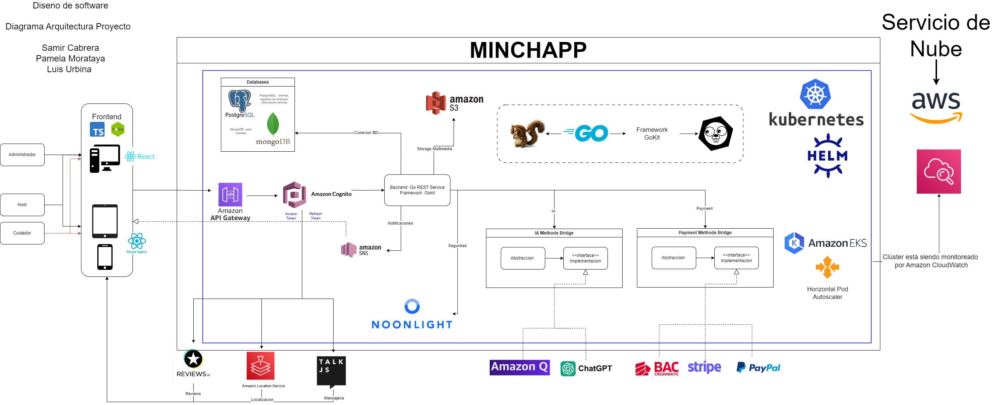

# Excerises 12 and 13 Software Design - Minchapp Project

Integrants: 

- Cabrera Samir 
- Morataya Pamela
- Urbina Luis

## Performance

### 1. Expected response times

The application aims for load times under 1 second with acceptable internet conditions, extending to 5 seconds in poor conditions. A timeout function will trigger an error after 5 seconds to prevent issues.

**Additional insights:**
- The use of Amazon API Gateway can help manage and optimize API requests, potentially improving response times.
- Kubernetes and Amazon EKS for container orchestration can aid in load balancing and scaling, which may contribute to maintaining consistent response times.

### 2. Concurrent user support

Initially expecting 10 users per hour, scaling up to 1000 users per hour as demand grows.

**Expanded explanation:**
- The architecture utilizes auto-scaling services like Amazon EKS with Horizontal Pod Autoscaler, which can automatically adjust resources based on demand.
- Amazon API Gateway can handle high volumes of API calls, supporting the concurrent user requirements.
- The use of multiple databases (PostgreSQL and MongoDB) suggests a strategy for distributing data load, which can help manage increased user concurrency.

### 3. Performance benchmarks

The application aims to match AirBnB's performance, with robust security, recognition systems, and an intuitive design.

**Additional considerations:**
- The use of React and React Native for the frontend can contribute to a responsive and user-friendly interface across different devices.
- Integration with services like Amazon Cognito for authentication and Amazon S3 for storage can help achieve AirBnB-like functionality and performance.

## Scalability

### 4. Handling increased load

The system uses auto-scaling AWS services to handle increased load automatically.

**Detailed explanation:**
- Amazon EKS with Horizontal Pod Autoscaler can automatically scale the number of pods based on CPU utilization or custom metrics.
- Amazon API Gateway can handle increased API traffic without manual intervention.
- The use of Amazon S3 for storage provides virtually unlimited scalability for data and media files.

### 5. Specific scalability requirements

The primary constraint is budget, as increased service consumption will increase costs.

**Additional insights:**
- Regular monitoring using Amazon CloudWatch (shown in the diagram) is crucial for tracking resource usage and costs.
- The architecture's use of microservices (evident from the Kubernetes setup) allows for independent scaling of different components as needed.

## Reliability

### 6. Acceptable downtime

With Kubernetes and cloud tools, the system aims for immediate recovery from minor issues. Major problems should have technical assistance within 4 hours.

**Expanded explanation:**
- The use of Kubernetes and Amazon EKS provides built-in resilience and self-healing capabilities for containerized applications.
- Amazon CloudWatch can be configured to alert administrators of issues, potentially reducing response times to major problems.

### 7. Handling failures and data integrity

The system uses automated backups, with frequency increasing as user population grows. Initially set for every 12 hours.

**Additional details:**
- The use of both PostgreSQL and MongoDB suggests a strategy for data redundancy and potentially different backup schedules for different types of data.
- Amazon S3's durability features can contribute to maintaining data integrity for stored files.

### 8. Backup and recovery procedures

**Explanation based on the architecture:**
- Database backups can be automated using native PostgreSQL and MongoDB backup tools, potentially stored in Amazon S3 for durability.
- Amazon EKS allows for easy rollbacks of deployments if issues are detected.
- The use of Helm charts (as shown in the diagram) can facilitate versioned deployments, making it easier to roll back to a previous known-good state if needed.

## Availability

### 9. Uptime requirements for the system

The system is expected to be available at all times, with particular emphasis on specific high-demand periods.

**Expanded explanation:**
- Given the use of AWS services and Kubernetes, the system is designed for high availability.
- The architecture supports this requirement through several components:
  - Amazon EKS (Elastic Kubernetes Service) provides managed Kubernetes clusters with built-in high availability features.
  - Use of multiple databases (PostgreSQL and MongoDB) suggests a strategy for data redundancy and potentially high availability setups for data storage.
  - Amazon API Gateway is designed to be highly available by default, distributed across multiple Availability Zones.
  - Amazon S3, used for storage, offers 99.99% availability SLA, supporting the overall system uptime.

**Additional considerations:**
- Implement health checks and liveness probes in Kubernetes to ensure rapid detection and replacement of failed components.
- Use of AWS Auto Scaling groups can help maintain availability by automatically replacing failed EC2 instances.
- Consider implementing a multi-region strategy for disaster recovery and even higher availability, although this isn't explicitly shown in the current architecture diagram.

### 10. Specific times when the system must be available without fail

The system must be reliably available from 2 PM to 10 PM, especially near holiday dates.

**Detailed insights:**
- This requirement suggests a need for dynamic scaling capabilities to handle increased load during peak hours.
- The architecture supports this through:
  - Kubernetes Horizontal Pod Autoscaler, which can automatically scale the number of pods based on observed metrics.
  - Amazon API Gateway, which can handle traffic spikes without manual intervention.
  - Amazon CloudWatch can be used to set up alarms and automated actions to ensure resources are scaled up in anticipation of these critical time windows.

**Additional strategies to ensure availability during critical times:**
1. **Scheduled scaling:** Use Kubernetes CronJobs or AWS scheduled actions to proactively scale up resources before the 2 PM peak time.
2. **Load testing:** Regularly perform load tests simulating peak holiday traffic to ensure the system can handle the load.
3. **Traffic management:** Utilize Amazon API Gateway's throttling and caching features to manage traffic spikes and reduce load on backend services.
4. **Database optimization:** Implement read replicas or sharding strategies in PostgreSQL and MongoDB t

## Security

### 11. Security requirements for data storage and transmission

**Expanded explanation based on the architecture:**
- The system uses HTTPS protocol for secure data transmission, as evidenced by the API Gateway in the diagram.
- Amazon Cognito is used for user authentication, providing a secure way to manage user identities.
- Data stored in Amazon S3 can be encrypted at rest using AWS's built-in encryption features.
- The use of Amazon API Gateway allows for implementation of API keys, OAuth tokens, and other security measures for API access.

### 12. User authentication and authorization management

Authentication is managed using Amazon Cognito.

**How Amazon Cognito works in this context:**
1. Users sign up and sign in through Cognito User Pools.
2. Cognito issues JWT tokens upon successful authentication.
3. These tokens are used to authorize access to other AWS services and the application's backend.
4. Cognito can integrate with social identity providers for federated authentication if needed.
5. It supports multi-factor authentication for enhanced security.

### 13. Compliance requirements for data security

The system must comply with data protection laws in each country where it operates, starting with Costa Rica.

**Additional considerations:**
- The use of AWS services can help with compliance, as many AWS services are designed to meet various regulatory standards.
- Encryption of data at rest and in transit (using S3 encryption and HTTPS) is crucial for compliance with most data protection regulations.
- The system's ability to handle user consent and data access requests should be built into the application logic.

## Usability

### 14. Usability standards for the user interface

The system aims for an accessible, simple, and intuitive design similar to Airbnb's user interface.

**Expanded explanation:**
- The architecture uses React and React Native for frontend development, supporting a consistent user-friendly interface across web and mobile platforms.
- Implement clear navigation structures, responsive design, and fast load times.
- Utilize Amazon S3 for efficient asset delivery and API Gateway for managing complex queries.
- Consider implementing a design system or component library to ensure UI consistency.
- Use code splitting and lazy loading in React for improved performance.

### 15. Accommodating users with disabilities

The system plans to have good contrast levels, necessary text, and future voice control assistance.

**Additional considerations:**
- Ensure screen reader compatibility by using semantic HTML and ARIA attributes.
- Implement full keyboard navigation and interaction.
- Maintain WCAG 2.1 compliant color contrast ratios.
- Provide text alternatives for non-text content, including alt text for images served from Amazon S3.
- Allow users to resize text without breaking the layout.
- Consider integrating Amazon Lex for future voice control features.
- Implement customizable UI settings, storing preferences in Amazon Cognito or the database.

### 16. Specific requirements for user training and documentation

Users are expected to have basic literacy skills and access to identification documents like passports, resumes, and background checks.

**Expanded approach:**
- Develop in-app guidance using tooltips and contextual help.
- Create a comprehensive, searchable knowledge base or FAQ section.
- Provide video tutorials for key features, potentially hosted on Amazon S3.
- Implement an interactive onboarding process for new users.
- Offer downloadable user guides in multiple formats (PDF, HTML).
- Consider integrating a chatbot using Amazon Lex for instant user support.
- Ensure all documentation is version-controlled and easily updatable.
- Provide localized documentation to support multiple languages.

## Maintainability

### 17. Ease of updating and modifying the system

The system is designed for easy expansion, using cloud services and design patterns like the Bridge pattern for payment processing.

**Expanded explanation:**
- The use of Kubernetes and Helm charts allows for easy deployment and updates of containerized applications.
- The microservices architecture (implied by the use of Kubernetes) allows for independent updating and modification of different system components.
- The Bridge pattern for payment methods (shown in the diagram) allows for easy addition of new payment providers without modifying core system logic.

### 18. Logging and monitoring requirements

All monitoring is done with AWS tools.

**Detailed explanation:**
- Amazon CloudWatch is used for monitoring, as shown in the diagram. It can collect and track metrics, collect and monitor log files, and set alarms.
- CloudWatch can be integrated with Amazon EKS to monitor container-level metrics.
- API Gateway provides built-in logging capabilities for API calls.
- Custom metrics can be sent to CloudWatch from the application for business-specific monitoring needs.

### 19. Version control and deployment handling

The system uses Helm charts for easy production deployment of Docker images and Kubernetes containers.

**Additional details:**
- Helm charts provide templating and versioning for Kubernetes manifests, making it easier to manage complex deployments.
- The use of Amazon EKS suggests that deployments can be managed through Kubernetes native tools and CI/CD pipelines.
- Version control for application code is likely managed through a service like GitHub or GitLab (not shown in the diagram but commonly used with this stack).

## Interoperability

### 20. Integration with existing software and hardware

The system functions as a REST API, using HTTPS protocol for effective and easy-to-implement communication.

**Expanded explanation based on the architecture:**
- Amazon API Gateway serves as the main entry point for API requests, allowing for easy integration with various clients (web, mobile, third-party services).
- The use of standard protocols and RESTful design makes it easier for other systems to interact with MINCHAPP.
- The architecture shows integration with several third-party services (Stripe, PayPal, ChatGPT, etc.), demonstrating the system's ability to interoperate with external systems.

### 21. Standards and protocols adherence

The system adheres to HTTPS protocol and REST API standards.

**Additional standards evident from the architecture:**
- OAuth 2.0 (implied by the use of Amazon Cognito for authentication)
- Docker container standards (as the system uses Kubernetes)
- Kubernetes API standards
- AWS-specific APIs and standards for various services used

## Compliance

### 22. Legal and regulatory requirements

The system must comply with data protection laws in each country where it operates, starting with Costa Rica.

**Expanded explanation:**
- Emphasis on personal data protection due to the large amount of personal information handled.
- The architecture supports compliance through:
  - Amazon Cognito for secure user authentication and authorization.
  - Encrypted databases (implied, not explicitly shown in the diagram).
  - HTTPS protocol for secure data transmission via Amazon API Gateway.
- Consider implementing:
  - Data retention and deletion policies in line with local regulations.
  - User consent management system, possibly integrated with the frontend React application.
  - Data access request handling procedures, potentially automated through the API.

### 23. Industry-specific standards

The system plans to use data encryption and a robust authorization scheme for database access.

**Additional considerations:**
- Implement encryption at rest for data stored in PostgreSQL, MongoDB, and Amazon S3.
- Use AWS Key Management Service (KMS) for managing encryption keys (not shown in diagram, but recommended).
- Follow OWASP (Open Web Application Security Project) guidelines for web application security.
- Consider compliance with standards such as:
  - PCI DSS if handling payment card information (relevant for integration with payment services shown in the diagram).
  - GDPR for handling European users' data (if applicable).
  - ISO 27001 for information security management.
- Regularly conduct security audits and penetration testing.
- Implement logging and monitoring using Amazon CloudWatch for audit trails and compliance reporting.

## Extensibility

### 24. Accommodating future enhancements

The system uses design patterns and a modular architecture to facilitate future enhancements.

**Detailed explanation based on the architecture:**
- The microservices architecture (implied by the use of Kubernetes) allows for easy addition of new services or enhancement of existing ones.
- The Bridge pattern used for payment methods allows for easy addition of new payment providers.
- The use of API Gateway allows for easy addition of new API endpoints or versions.
- The frontend's use of React and React Native suggests a component-based architecture that can be easily extended.

### 25. Critical areas for extensibility

Data consumption from databases and system availability are critical areas for extensibility.

**Additional insights:**
- The use of both PostgreSQL and MongoDB suggests a polyglot persistence approach, allowing for easy addition of new data stores as needed.
- The auto-scaling capabilities of Amazon EKS and other AWS services ensure that the system can handle increased load as it grows.
- The modular architecture allows for easy addition of new features or integration with new third-party services (like the various services shown at the bottom of the diagram).

## Localization

### 26. Requirements for supporting multiple languages and regions

The system will initially support English and Spanish, with USD and Costa Rican Colón as currencies.

**Expanded approach:**
- Implement internationalization (i18n) in the React frontend.
- Store localized content in the database (PostgreSQL or MongoDB).
- Use Amazon CloudFront for efficient delivery of localized static content.
- Implement a content management system for easy management of localized content.
- Consider using Amazon Translate for automatic translation of user-generated content.

### 27. Handling different date, time, and currency formats

The system will obtain user location data and use a fixed time zone. A currency conversion service is recommended.

**Additional considerations:**
- Use libraries like Moment.js or date-fns in the frontend for consistent date and time handling.
- Store all dates in UTC in the database and convert to local time in the frontend.
- Implement server-side date and time handling in the Go backend for consistency.
- Use a reliable currency conversion API or service for real-time exchange rates.
- Consider caching exchange rates in Amazon ElastiCache for improved performance.
- Implement locale-aware input parsing and formatting for dates, times, and currencies.
- Use ISO standards for storing language (ISO 639) and country (ISO 3166) codes.

## Documentation

### 28. Required documentation

**For users:**
- Registration process
- Uploading personal data
- Basic activities
- Troubleshooting and common errors
- Payment procedures

**For administrators:**
- Legal management
- Data management
- Payment management

**For developers:**
- Code must meet internal and external documentation standards
- The programming team must maintain constant contact for developing new features in new countries

**Additional considerations based on the architecture:**
- Documentation for each AWS service used and how they're configured
- Kubernetes and Helm chart configuration and usage
- API documentation (possibly using tools like Swagger/OpenAPI)
- Security protocols and procedures
- Database schema and data flow documentation
- Third-party service integration details

### 29. Documentation maintenance and updates

Interactive documentation is planned. Developers will use a GitHub or GitLab repository, administrators will have access to a shared cloud, and users will have a dedicated space on the web.

**Expanded approach:**
- Use of tools like Swagger/OpenAPI for API documentation, which can be automatically updated with code changes
- Integration of documentation into the CI/CD pipeline to ensure it stays up-to-date
- Version control for all documentation, matching software versions
- Regular review and update cycles, especially after major feature additions or changes
- User feedback mechanism to identify areas of documentation that need improvement or clarification

---

Minchapp Architecture Diagram