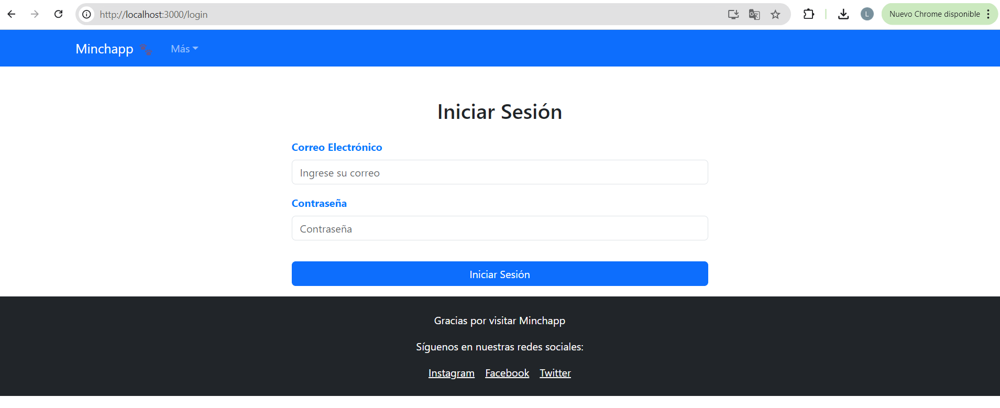
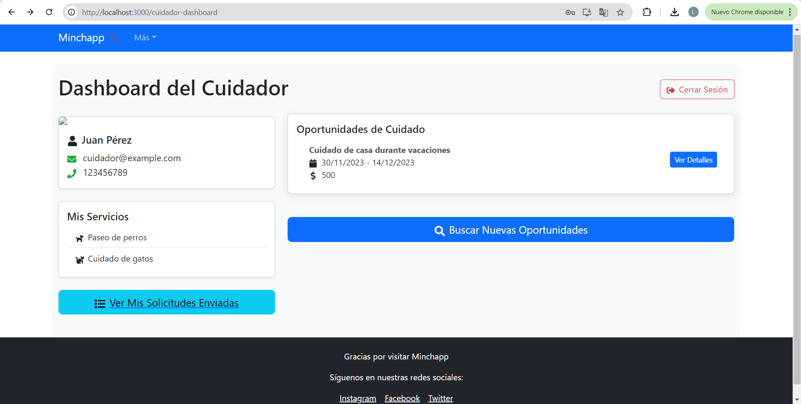
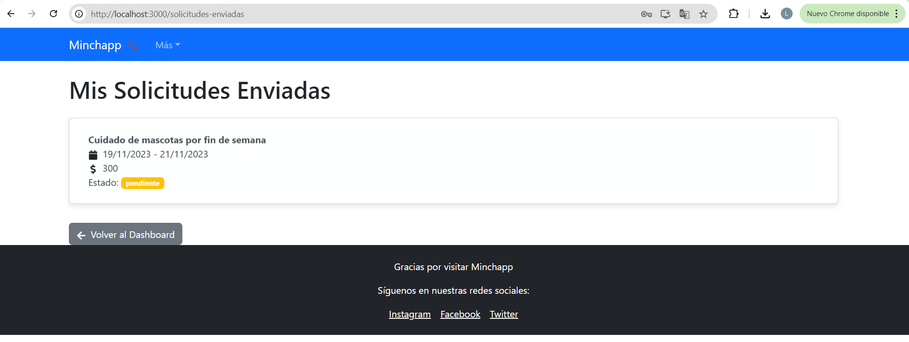
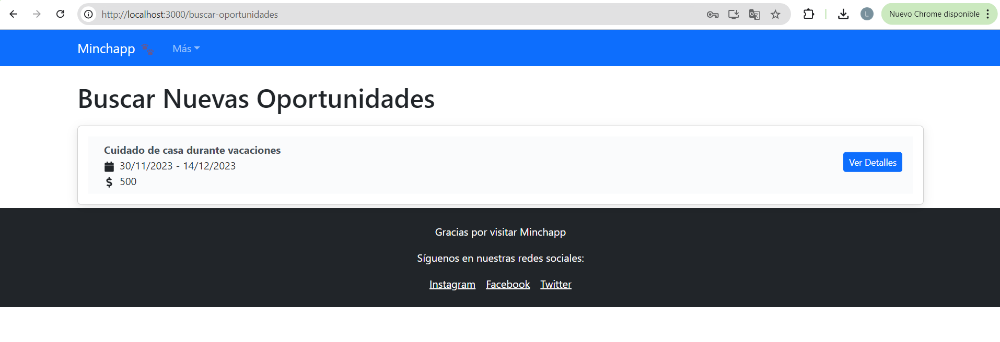
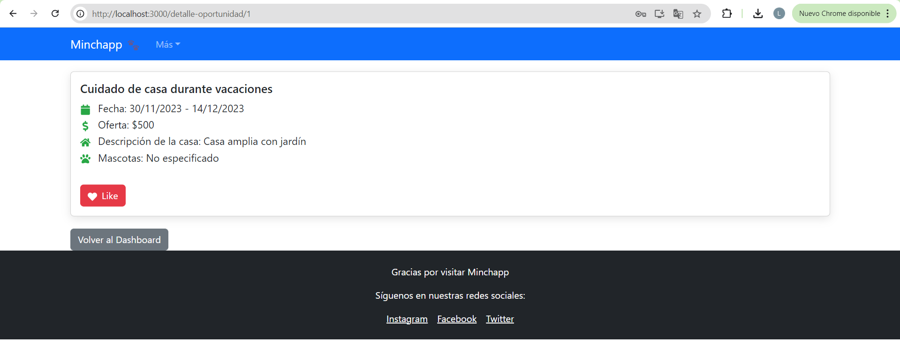
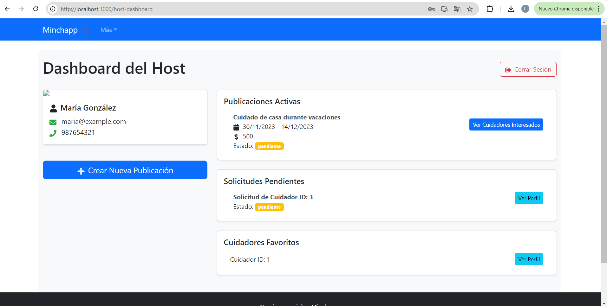
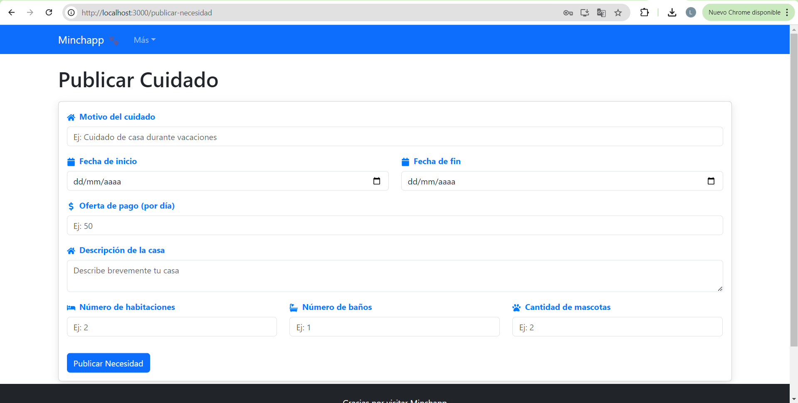
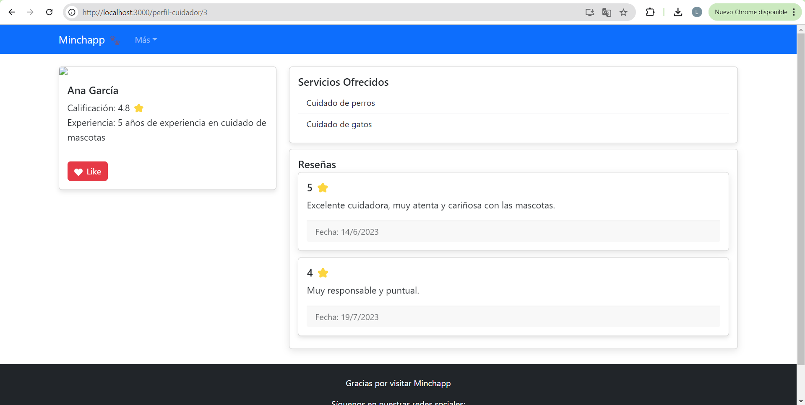
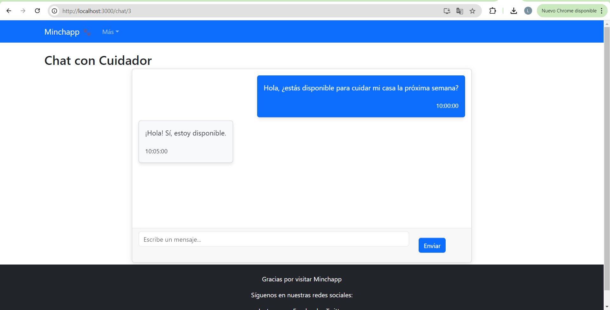

# MinchappFE

## Boilerplate

Link al README del boilerplate de FE: 

## Matriz de Requerimientos vs Componentes Visuales

| Requerimiento                                          | ListaCuidadores | PerfilCuidador | ComparacionCuidadores | FormularioContacto | DashboardHost | PublishCareNeed | NotificacionesCuidadores | ChatComponent |
|--------------------------------------------------------|-----------------|----------------|----------------------|---------------------|---------------|-----------------|--------------------------|---------------|
| Visualizar información de cuidadores                   | X               | X              | X                    |                     |               |                 |                          |               |
| Ver detalles de cuidadores                             |                 | X              |                      |                     |               |                 |                          |               |
| Crear vínculo con el dueño de la casa                  |                 | X              |                      | X                   |               |                 |                          |               |
| Mostrar media de los cuidadores                        |                 | X              |                      |                     |               |                 |                          |               |
| Mostrar redes sociales de cuidadores                   |                 | X              |                      |                     |               |                 |                          |               |
| Mostrar reviews y testimonios                          |                 | X              |                      |                     |               |                 |                          |               |
| Mostrar depósitos de garantía                          |                 | X              |                      |                     |               |                 |                          |               |
| Mostrar rates de cuidadores                            | X               | X              | X                    |                     |               |                 |                          |               |
| Mostrar hoja de delincuencia                           |                 | X              |                      |                     |               |                 |                          |               |
| Integración con IA para recomendaciones                | X               |                |                      |                     |               |                 |                          |               |
| Geolocalización y cálculo de distancia                 | X               |                |                      |                     |               |                 |                          |               |
| Mostrar facilidades y credenciales                     |                 | X              | X                    |                     |               |                 |                          |               |
| Paginación de resultados                               | X               |                |                      |                     |               |                 |                          |               |
| Marcar cuidadores como favoritos                       | X               |                |                      |                     | X             |                 |                          |               |
| Enviar solicitud de contacto                           |                 |                |                      | X                   |               |                 |                          |               |
| Publicar necesidad de cuidado                          |                 |                |                      |                     | X             | X               |                          |               |
| Gestionar solicitudes de cuidadores                    |                 |                |                      |                     | X             |                 | X                        |               |
| Visualizar publicaciones activas                       |                 |                |                      |                     | X             |                 |                          |               |
| Comunicarse con cuidadores                             |                 |                |                      |                     |               |                 |                          | X             |
| Gestionar perfil de usuario                            |                 |                |                      |                     | X             |                 |                          |               |
| Visualizar y gestionar cuidadores favoritos            |                 |                |                      |                     | X             |                 |                          |               |
| Ver notificaciones de cuidadores interesados           |                 |                |                      |                     |               |                 | X                        |               |
| Aceptar o rechazar solicitudes de cuidadores           |                 |                |                      |                     |               |                 | X                        |               |

-----------------------------------------
## Pantallas

### 1. Login

En esta pantalla, el usuario puede iniciar sesión en la aplicación.

Acciones:
- Ingresar correo electrónico y contraseña
- Hacer clic en "Iniciar sesión"

Mensajes de error:
- "Correo electrónico o contraseña incorrectos" si las credenciales son inválidas
- "Por favor, complete todos los campos" si algún campo está vacío

### 2. Dashboard del cuidador 

Esta es la pantalla principal para los cuidadores después de iniciar sesión.

Acciones:
- Ver perfil personal
- Acceder a "Buscar oportunidades"
- Ver "Solicitudes enviadas"
- Cerrar sesión

### 3. Solicitudes enviadas

Aquí el cuidador puede ver las solicitudes que ha enviado a los hosts.

Acciones:
- Cancelar solicitudes pendientes

Mensajes de confirmación:
- "Solicitud cancelada exitosamente" al cancelar una solicitud

### 4. Buscar Oportunidades 

En esta pantalla, los cuidadores pueden buscar oportunidades de trabajo.

Acciones:
- Ver detalles de una oportunidad

### 5. Ver detalles 

Esta pantalla muestra los detalles completos de una oportunidad de cuidado.

Acciones:
- Leer información detallada
- Enviar solicitud

Mensajes de confirmación:
- "Liked" al dar like a una publicación
- "Te ha gustado esta oportunidad. El host será notificado." al darle like

### 6. Dashboard del host 

Esta es la pantalla principal para los hosts después de iniciar sesión.

Acciones:
- Publicar una nueva necesidad de cuidado
- Ver cuidadores interesados
- Ver perfil de cuidador
- Cerrar sesión

### 7. Publicar Cuidado 

Los hosts pueden publicar una nueva necesidad de cuidado en esta pantalla.

Acciones:
- Llenar el formulario con los detalles del cuidado requerido
- Publicar la necesidad de cuidado

Mensajes de error:
- "Por favor, complete todos los campos obligatorios" si falta información

### 8. Cuidadores interesados

Los hosts pueden ver los cuidadores que han mostrado interés en sus publicaciones.

Acciones:
- Ver perfiles de cuidadores interesados
- Aceptar o rechazar solicitudes
- Iniciar chat con cuidadores aceptados

Mensajes de confirmación:
- "Solicitud aceptada" al aceptar un cuidador
- "Solicitud rechazada" al rechazar un cuidador

### 9. Ver perfil 

Esta pantalla muestra el perfil detallado de un cuidador.

Acciones:
- Ver información detallada del cuidador
- Dar like a al cuidador

### 10. Chat 

Pantalla de chat entre host y cuidador.

Acciones:
- Enviar mensajes
- Ver historial de conversación
