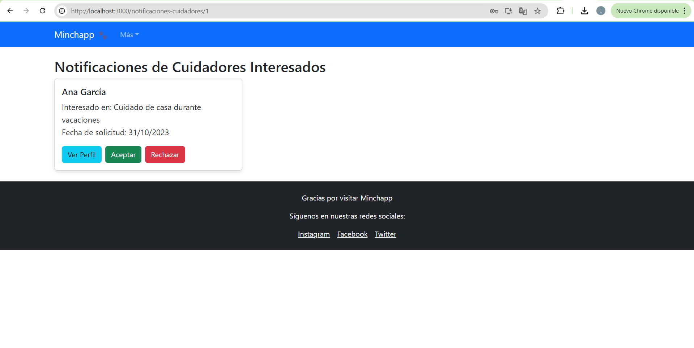

# MinchappFE

## Boilerplate

Link al README del boilerplate de FE: 

## Matriz de Requerimientos vs Componentes Visuales

| Requerimiento                                          | ListaCuidadores | PerfilCuidador | ComparacionCuidadores | FormularioContacto | DashboardHost | PublishCareNeed | NotificacionesCuidadores | ChatComponent |
|--------------------------------------------------------|-----------------|----------------|----------------------|---------------------|---------------|-----------------|--------------------------|---------------|
| Visualizar información de cuidadores                   | X               | X              | X                    |                     |               |                 |                          |               |
| Ver detalles de cuidadores                             |                 | X              |                      |                     |               |                 |                          |               |
| Crear vínculo con el dueño de la casa                  |                 | X              |                      | X                   |               |                 |                          |               |
| Mostrar media de los cuidadores                        |                 | X              |                      |                     |               |                 |                          |               |
| Mostrar redes sociales de cuidadores                   |                 | X              |                      |                     |               |                 |                          |               |
| Mostrar reviews y testimonios                          |                 | X              |                      |                     |               |                 |                          |               |
| Mostrar depósitos de garantía                          |                 | X              |                      |                     |               |                 |                          |               |
| Mostrar rates de cuidadores                            | X               | X              | X                    |                     |               |                 |                          |               |
| Mostrar hoja de delincuencia                           |                 | X              |                      |                     |               |                 |                          |               |
| Integración con IA para recomendaciones                | X               |                |                      |                     |               |                 |                          |               |
| Geolocalización y cálculo de distancia                 | X               |                |                      |                     |               |                 |                          |               |
| Mostrar facilidades y credenciales                     |                 | X              | X                    |                     |               |                 |                          |               |
| Paginación de resultados                               | X               |                |                      |                     |               |                 |                          |               |
| Marcar cuidadores como favoritos                       | X               |                |                      |                     | X             |                 |                          |               |
| Enviar solicitud de contacto                           |                 |                |                      | X                   |               |                 |                          |               |
| Publicar necesidad de cuidado                          |                 |                |                      |                     | X             | X               |                          |               |
| Gestionar solicitudes de cuidadores                    |                 |                |                      |                     | X             |                 | X                        |               |
| Visualizar publicaciones activas                       |                 |                |                      |                     | X             |                 |                          |               |
| Comunicarse con cuidadores                             |                 |                |                      |                     |               |                 |                          | X             |
| Gestionar perfil de usuario                            |                 |                |                      |                     | X             |                 |                          |               |
| Visualizar y gestionar cuidadores favoritos            |                 |                |                      |                     | X             |                 |                          |               |
| Ver notificaciones de cuidadores interesados           |                 |                |                      |                     |               |                 | X                        |               |
| Aceptar o rechazar solicitudes de cuidadores           |                 |                |                      |                     |               |                 | X                        |               |

-----------------------------------------
## Pantallas

### 1. Login

### Dashboard del cuidador 

### Solicitudes enviadas

### Buscar Oportunidades 

### Ver detalles 

### Like a la publicacion 

### Dashboard del host 

### Publicar Cuidado 

### Cuidadores interesados

### Ver perfil 

