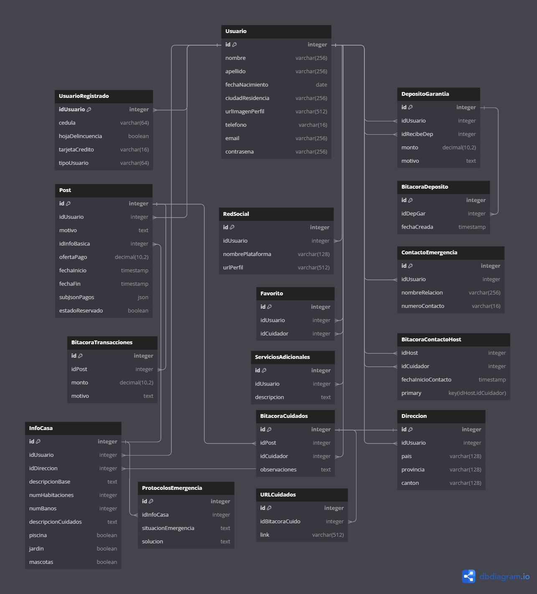

# Diseño del modelo de datos 



# Tablas en PostgreSQL
```
-- Tabla: Usuario
CREATE TABLE Usuario (
    id SERIAL PRIMARY KEY,
    nombre VARCHAR(256) NOT NULL,
    apellido VARCHAR(256) NOT NULL,
    fechaNacimiento DATE,
    ciudadResidencia VARCHAR(256),
    urlImagenPerfil VARCHAR(512),
    telefono VARCHAR(16),
    email VARCHAR(256),
    contrasena VARCHAR(256)
);

-- Tabla: Usuario Registrado
CREATE TABLE UsuarioRegistrado (
    idUsuario INTEGER REFERENCES Usuario(id),
    cedula VARCHAR(64),
    hojaDelincuencia BOOLEAN,
    tarjetaCredito VARCHAR(16),
    tipoUsuario VARCHAR(64),
    PRIMARY KEY (idUsuario)
);

-- Tabla: Red Social
CREATE TABLE RedSocial (
    id SERIAL PRIMARY KEY,
    idUsuario INTEGER REFERENCES Usuario(id),
    nombrePlataforma VARCHAR(128),
    urlPerfil VARCHAR(512)
);

-- Tabla: Depósito de Garantía
CREATE TABLE DepositoGarantia (
    id SERIAL PRIMARY KEY,
    idUsuario INTEGER REFERENCES Usuario(id),
    idRecibeDep INTEGER REFERENCES Usuario(id),
    monto DECIMAL(10, 2),
    motivo TEXT
);

-- Tabla: Bitácora Depósito
CREATE TABLE BitacoraDeposito (
    id SERIAL PRIMARY KEY,
    idDepGar INTEGER REFERENCES DepositoGarantia(id),
    fechaCreada TIMESTAMP DEFAULT NOW()
);

-- Tabla: Servicios Adicionales
CREATE TABLE ServiciosAdicionales (
    id SERIAL PRIMARY KEY,
    idUsuario INTEGER REFERENCES Usuario(id),
    descripcion TEXT
);

-- Tabla: Dirección
CREATE TABLE Direccion (
    id SERIAL PRIMARY KEY,
    idUsuario INTEGER REFERENCES Usuario(id),
    pais VARCHAR(128),
    provincia VARCHAR(128),
    canton VARCHAR(128)
);

-- Tabla: Contacto de Emergencia
CREATE TABLE ContactoEmergencia (
    id SERIAL PRIMARY KEY,
    idUsuario INTEGER REFERENCES Usuario(id),
    nombreRelacion VARCHAR(256),
    numeroContacto VARCHAR(16)
);

-- Tabla: Bitácora de Transacciones
CREATE TABLE BitacoraTransacciones (
    id SERIAL PRIMARY KEY,
    idPost INTEGER,
    monto DECIMAL(10, 2),
    motivo TEXT
);

-- Tabla: Bitácora de Cuidados
CREATE TABLE BitacoraCuidados (
    id SERIAL PRIMARY KEY,
    idPost INTEGER,
    idCuidador INTEGER REFERENCES Usuario(id),
    observaciones TEXT
);

-- Tabla: URL de Cuidados
CREATE TABLE URLCuidados (
    id SERIAL PRIMARY KEY,
    idBitacoraCuido INTEGER REFERENCES BitacoraCuidados(id),
    link VARCHAR(512)
);

-- Tabla: Protocolos de Emergencia
CREATE TABLE ProtocolosEmergencia (
    id SERIAL PRIMARY KEY,
    idInfoCasa INTEGER,
    situacionEmergencia TEXT,
    solucion TEXT
);

-- Tabla: Favorito
CREATE TABLE Favorito (
    id SERIAL PRIMARY KEY,
    idUsuario INTEGER REFERENCES Usuario(id),
    idCuidador INTEGER REFERENCES Usuario(id)
);

-- Tabla: Bitácora Contacto Host
CREATE TABLE BitacoraContactoHost (
    idHost INTEGER REFERENCES Usuario(id),
    idCuidador INTEGER REFERENCES Usuario(id),
    fechaInicioContacto TIMESTAMP,
    PRIMARY KEY (idHost, idCuidador)
);
```

# Llenado de tablas en PostgreSQL

```------ POSGRESQL ------
{
  "Usuario": [
    {
      "id": 1,
      "nombre": "Juan",
      "apellido": "Pérez",
      "fechaNacimiento": "1985-05-15",
      "ciudadResidencia": "Madrid",
      "urlImagenPerfil": "http://example.com/imagen.jpg",
      "telefono": "123456789",
      "email": "juan@example.com",
      "contrasena": "contraseña123"
    }
  ],
  "UsuarioRegistrado": [
    {
      "idUsuario": 1,
      "cedula": "V-12345678",
      "hojaDelincuencia": false,
      "tarjetaCredito": "1234-5678-9012-3456",
      "tipoUsuario": "Cuidador"
    }
  ],
  "RedSocial": [
    {
      "id": 1,
      "idUsuario": 1,
      "nombrePlataforma": "Facebook",
      "urlPerfil": "http://facebook.com/juan.perez"
    }
  ],
  "DepositoGarantia": [
    {
      "id": 1,
      "idUsuario": 1,
      "idRecibeDep": 1,
      "monto": 200.00,
      "motivo": "Depósito para reservas"
    }
  ],
  "BitacoraDeposito": [
    {
      "id": 1,
      "idDepGar": 1,
      "fechaCreada": "2024-10-01T12:30:00Z"
    }
  ],
  "ServiciosAdicionales": [
    {
      "id": 1,
      "idUsuario": 1,
      "descripcion": "Cuidado de mascotas"
    }
  ],
  "Direccion": [
    {
      "id": 1,
      "idUsuario": 1,
      "pais": "España",
      "provincia": "Madrid",
      "canton": "Madrid"
    }
  ],
  "ContactoEmergencia": [
    {
      "id": 1,
      "idUsuario": 1,
      "nombreRelacion": "Hermano",
      "numeroContacto": "987654321"
    }
  ],
  "BitacoraTransacciones": [
    {
      "id": 1,
      "idPost": 1,
      "monto": 150.00,
      "motivo": "Pago por servicio"
    }
  ],
  "BitacoraCuidados": [
    {
      "id": 1,
      "idPost": 1,
      "idCuidador": 1,
      "observaciones": "Se siguieron todas las instrucciones."
    }
  ],
  "URLCuidados": [
    {
      "id": 1,
      "idBitacoraCuido": 1,
      "link": "http://example.com/instrucciones"
    }
  ],
  "ProtocolosEmergencia": [
    {
      "id": 1,
      "idInfoCasa": 1,
      "situacionEmergencia": "Incendio",
      "solucion": "Llamar al 112 y evacuar el edificio."
    }
  ],
  "Favorito": [
    {
      "id": 1,
      "idUsuario": 1,
      "idCuidador": 1
    }
  ]
}
```

# Tablas MongoDB

```
import mongoose, { Schema, Document, model } from 'mongoose';

// Interfaz para el modelo `Post`
interface IPost extends Document {
  idUsuario: number;
  motivo: string;
  idInfoBasica: number;
  ofertaPago: number;
  fechaInicio: Date;
  fechaFin: Date;
  subJsonPagos: Record<string, unknown>;
  estadoReservado: boolean;
}

// Esquema de `Post`
const PostSchema = new Schema<IPost>({
  idUsuario: { type: Number, required: true },
  motivo: { type: String, required: true },
  idInfoBasica: { type: Number, required: true },
  ofertaPago: { type: Number, required: true },
  fechaInicio: { type: Date, required: true },
  fechaFin: { type: Date, required: true },
  subJsonPagos: { type: Object, default: {} },
  estadoReservado: { type: Boolean, default: false }
});

// Crear modelos a partir de los esquemas
const PostModel = model<IPost>('Post', PostSchema);

export { PostModel };
```
```
import mongoose, { Schema, Document, model } from 'mongoose';

// Interfaz para el modelo `InfoCasa`
interface IInfoCasa extends Document {
  idUsuario: number;
  idDireccion: number;
  descripcionBase: string;
  numHabitaciones: number;
  numBanos: number;
  descripcionCuidados: string;
  piscina: boolean;
  jardin: boolean;
  mascotas: boolean;
}

// Esquema de `InfoCasa`
const InfoCasaSchema = new Schema<IInfoCasa>({
  idUsuario: { type: Number, required: true },
  idDireccion: { type: Number, required: true },
  descripcionBase: { type: String, required: true },
  numHabitaciones: { type: Number, required: true },
  numBanos: { type: Number, required: true },
  descripcionCuidados: { type: String, required: true },
  piscina: { type: Boolean, required: true },
  jardin: { type: Boolean, required: true },
  mascotas: { type: Boolean, required: true }
});

// Crear modelos a partir de los esquemas
const InfoCasaModel = model<IInfoCasa>('InfoCasa', InfoCasaSchema);

export {InfoCasaModel };
```

# Llenado de tablas en MongoDB

```
"Post": [
    {
      "id": 1,
      "idUsuario": 1,
      "motivo": "Necesito un cuidador para mi mascota",
      "idInfoBasica": 1,
      "ofertaPago": 100.00,
      "fechaInicio": "2024-10-05T00:00:00Z",
      "fechaFin": "2024-10-12T00:00:00Z",
      "subJsonPagos": {},
      "estadoReservado": false
    }
  ]
```
```
"InfoCasa": [
    {
      "id": 1,
      "idUsuario": 1,
      "idDireccion": 1,
      "descripcionBase": "Casa acogedora en el centro de Madrid",
      "numHabitaciones": 3,
      "numBanos": 2,
      "descripcionCuidados": "Ideal para familias y mascotas",
      "piscina": false,
      "jardin": true,
      "mascotas": true
    }
  ]
```